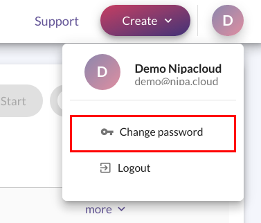
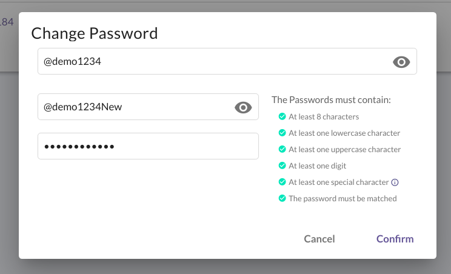
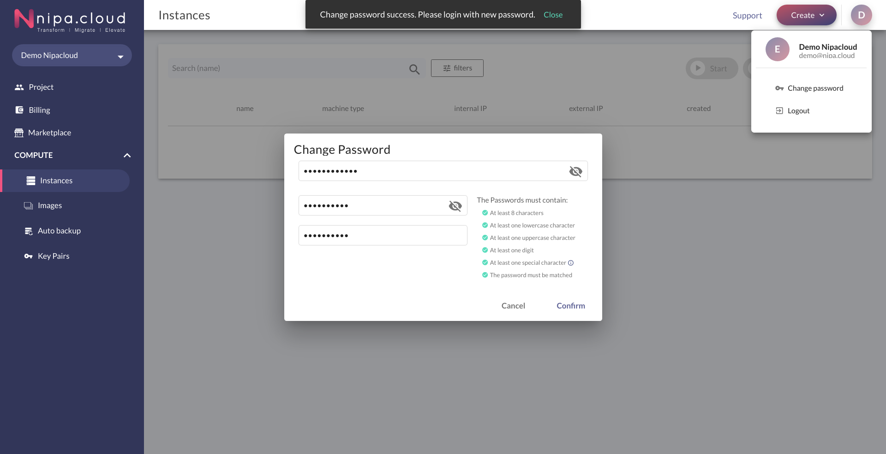
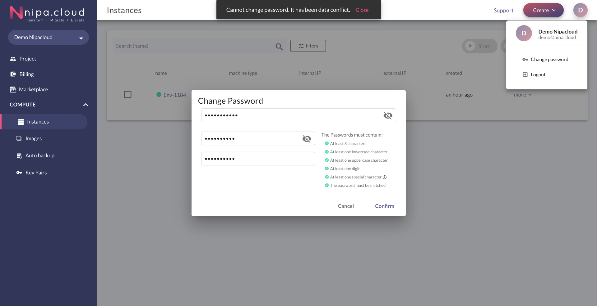

# Change Password

1.คลิกเปิด Menu ในส่วนของชื่อผู้ใช้งาน และเลือก **Change Password**

2.กรอกข้อมูลในแบบฟอร์มที่แสดง โดย

* **Current Password**: รหัสผ่านเดิมที่ผู้ใช้งานเคยใช้  
* **New Password**: รหัสผ่านใหม่ที่ต้องการ  
* **Confirm New Password**: ยืนยันรหัสผ่านใหม่ที่ต้องการ

หลังจากกรอกข้อมูลเรียบร้อยแล้ว ให้คลิก Confirm

3.เมื่อระบบเปลี่ยนรหัสผ่านให้สำเร็จ จะแสดงข้อความแจ้งให้ผู้ใช้งานทราบ และแสดงกลับไปยังหน้า Login เพื่อให้ผู้ใช้งานกรอกข้อมูลในการเข้าใช้งานระบบใหม่อีกครั้ง


หากผู้ใช้งานกรอกรหัสปัจจุบัน หรือข้อมูลใดๆไม่ถูกต้อง จะทำให้ระบบไม่สามารถเปลี่ยนรหัสผ่านผู้ใช้งานได้ ดังนั้นระบบจะแสดงข้อความแจ้งเตือนดังรูป


