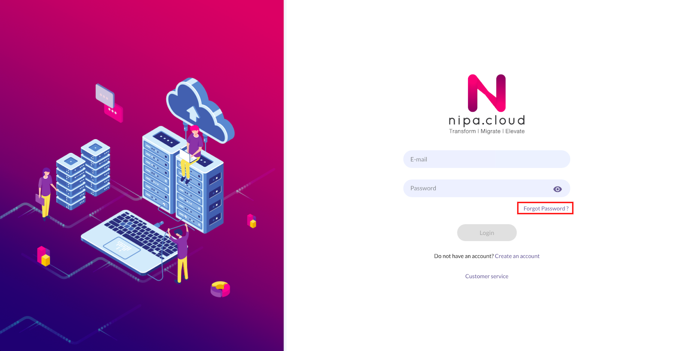
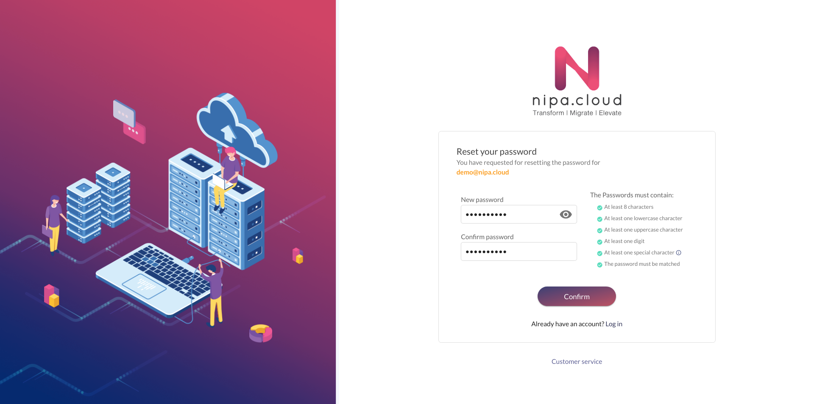

# Forgot Password

การรีเซ็ตรหัสผ่านสมาชิกของระบบ Nipa Cloud Platform \(NCP\) สามารถทำได้ที่หน้า [http://portal.nipa.cloud/forgot-password](http://portal.nipa.cloud/forgot-password) โดยมีขั้นตอนดังนี้

1.คลิก **Forgot Password**

2.กรอก **Email** ที่ใช้ในการสมัครสมาชิก แล้วทำการคลิก Send

3.หลังจากนั้นระบบจะทำการส่ง Email สำหรับการรีเซ็ตรหัสผ่านสมาชิกของระบบ Nipa Cloud Platform \(NCP\) โดยมีข้อความแจ้งว่า "E-mail was successfully sent"**.**

4.จากนั้นให้เข้าไปยัง Email ที่กรอกจากข้อข้างต้น แล้วคลิก RESET PASSWORD


หากไม่ได้รับ Email หมายความว่า Email ที่กรอกจากข้างต้นนั้น ไม่มีอยู่ในระบบ


5.เมื่อเข้ามายังหน้า **Reset password** ให้ทำการกรอก Password ใหม่ โดยจะต้องถูกต้องตามเงื่อนไข แล้วจึงจะกด Confirm เพื่อ Reset password ได้

6.เมื่อระบบทำการ Reset password ได้สำเร็จ จะได้รับการ Redirect ไปยังหน้า Login พร้อมกับแสดงข้อความว่า "Reset your password is success".

