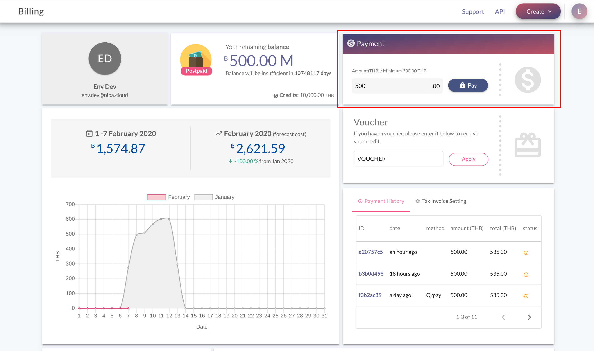
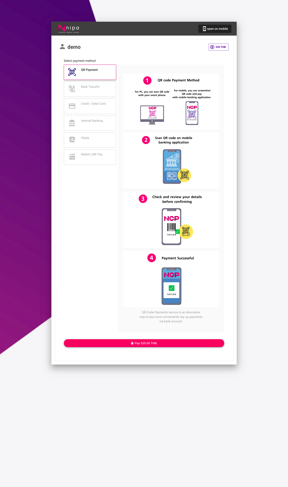
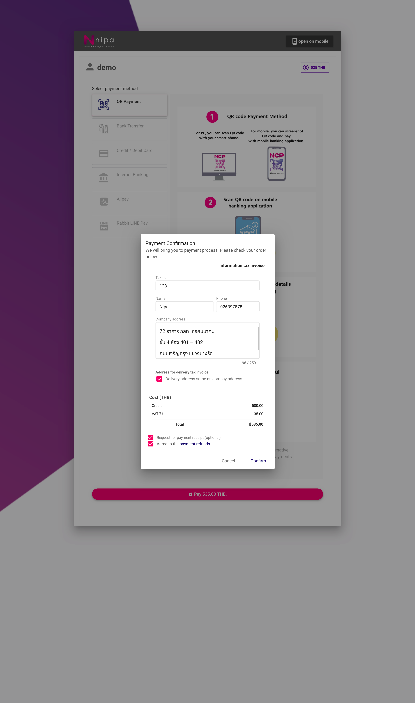
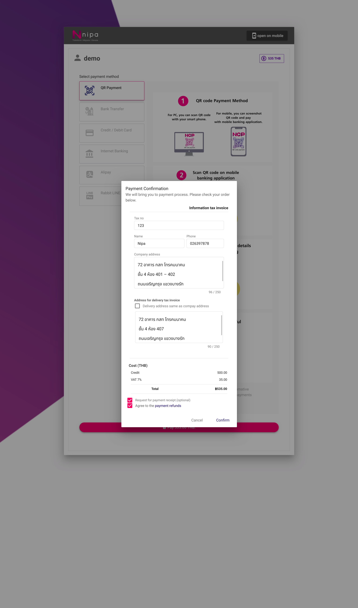
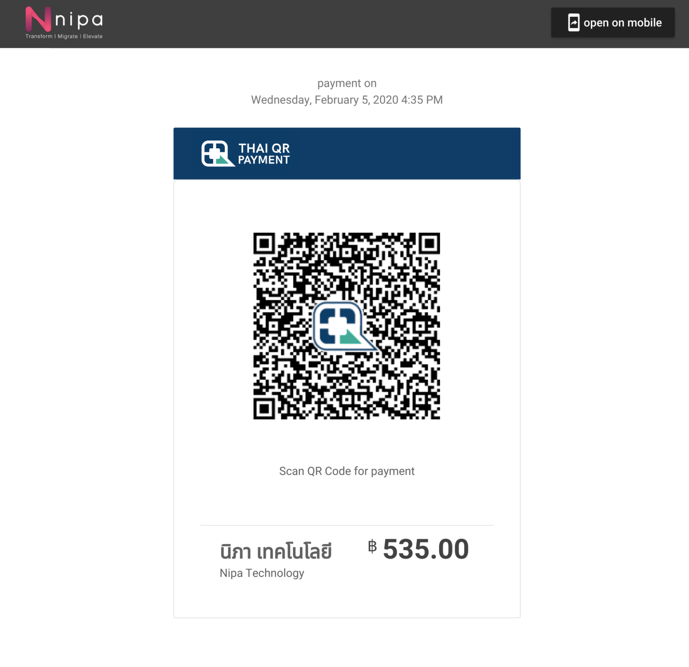
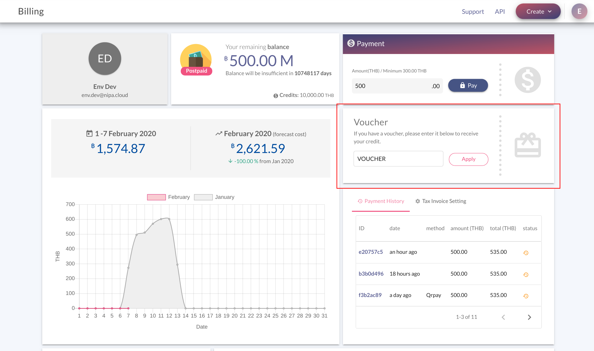
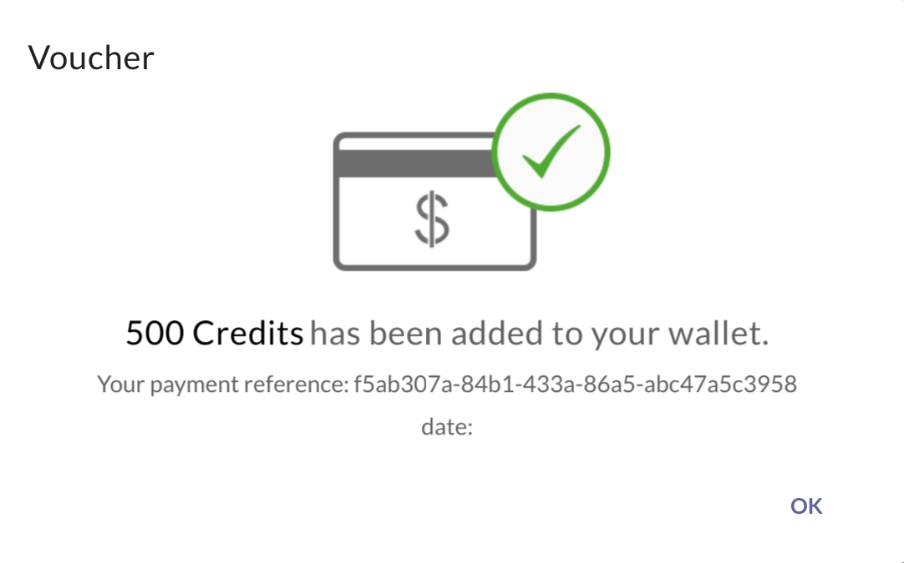

# Top up

## Payment

การเติมเงินผ่าน Payment มีขั้นตอนดังนี้

1. ไปยังหน้า **Billing** แล้วใส่จำนวนเงินที่ต้องการเติมลงไปในเมนู Payment หลังจากนั้นให้กดปุ่ม "Pay"    

2. **Payment Method:** เลือกวิธีการชำระเงินที่ต้องการ หลังจากนั้นให้กดปุ่ม "Pay"

3. **Tax invoice:** \(Optional\) หากไม่ต้องการ Tax invoice ให้ข้ามไปยังข้อ 4

คลิกที่ช่อง **"Request for payment receipt"** แล้วกรอกข้อมูลลงไปตามช่องว่าง

และถ้าหากที่อยู่ที่ต้องการให้ส่ง Tax invoice ต่างกับข้อมูลที่กรอก ให้คลิกที่ช่อง **"Delivery address same as company address"** แล้วกรอกที่อยู่ที่ต้องการให้ส่ง tax invoice ลงไป

4. คลิกที่ช่อง "**Agree to the payment refunds**" แล้วกดปุ่ม "Comfirm" เพิ้อเข้าสู่ขั้นตอนการชำระเงิน ตามวิธีการชำระเงินที่ได้เลือกไว้  

6. **QR Payment:**  ระบบจะทำการแสดง QR code สำหรับการชำระเงินดังภาพ    

**Payment method** อื่น ๆ

* **Bank Transfer:** Admin จะทำการตรวจสอบหลักฐานการชำระเงิน ภายใน 30 นาที ในช่วงเวลาทำการ แล้วจะแจ้งผลให้ผู้ใช้งานผ่านทาง E-mail ที่ลงทะเบียนไว้ 
* **Credit / Debit Card:** ทำตามขั้นตอนของ Omise 
* **Internet Banking:** ทำการขั้นตอนการทำธุรกรรมของธนาคารที่เลือก 
* **Alipay:** ทำการขั้นตอนของ Alipay 
* **Rabbit LINE Pay:** ทำตามขั้นตอนของ Rabbit LINE Pay 

## Voucher

การเติมเงินผ่าน **Voucher** มีขั้นตอนดังนี้

1. ไปยังหน้า **Billing** แล้วใส่จำนวนเงินที่ต้องการเติมลงไปในเมนู **Voucher** หลังจากนั้นให้กดปุ่ม "Apply"    

2. หาก **Voucher** ถูกต้อง จะได้ระบบจะแจ้งดังภาพต่อไปนี้

