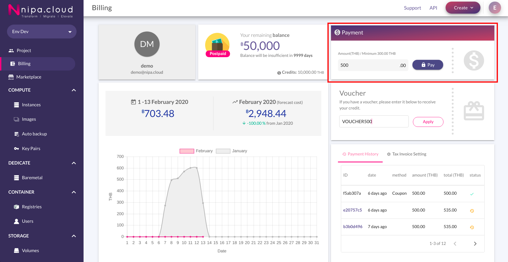
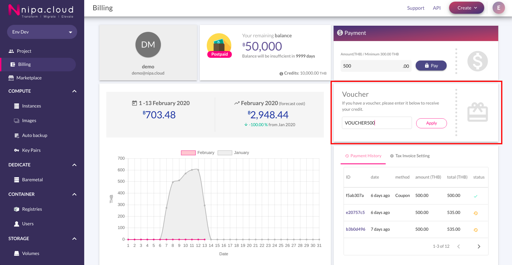

# Top up

การเติมเงินผ่าน **Payment** มีขั้นตอนดังนี้

ไปยังหน้า **Billing** แล้วใส่จำนวนเงินที่ต้องการเติมลงไปในเมนู Payment หลังจากนั้นให้กดปุ่ม Pay

## **Payment Methods**

สามารถเลือกวิธีการชำระเงินที่ต้องการได้ดังนี้

* **QR Payment:** แสดง QR code สำหรับการชำระเงิน
* **Bank Transfer:** Admin จะทำการตรวจสอบหลักฐานการชำระเงิน ภายใน 30 นาที ในช่วงเวลาทำการ แล้วจะแจ้งผลให้ผู้ใช้งานผ่านทาง E-mail ที่ลงทะเบียนไว้ 
* **Credit / Debit Card:** ทำตามขั้นตอนของ Omise 
* **Internet Banking:** ทำการขั้นตอนการทำธุรกรรมของธนาคารที่เลือก 
* **Alipay:** ทำการขั้นตอนของ Alipay 
* **Rabbit LINE Pay:** ทำตามขั้นตอนของ Rabbit LINE Pay 

### **QR Payment**

ระบบจะทำการแสดง QR code สำหรับการชำระเงินดังภาพ    

### Bank Transfer

สำหรับการเลือกผ่าน **Bank Transfer** นั้น มีขั้นตอนต่างจากวิธีอื่น ๆ คือระบบจะแสดงข้อมูลบัญชี ให้ผู้ใช้งานทำการเลือกบัญชีที่ต้องการชำระเงิน โดยสามารถคลิกที่เลขบัญชีที่ต้องการ เพื่อทำการ Copy เลขบัญชีได้

หลังจากชำระเงินให้ทำการอัพโหลดรูปสลิป

จากนั้นให้กดปุ่ม Pay

### **Tax invoice**

\(Optional\) คลิกที่ช่อง **"Request for payment receipt"** แล้วกรอกข้อมูลลงไปตามช่องว่าง

และถ้าหากที่อยู่ที่ต้องการให้ส่ง Tax invoice ต่างกับข้อมูลที่กรอก ให้คลิกที่ช่อง **"Delivery address same as company address"** แล้วกรอกที่อยู่ที่ต้องการให้ส่ง Tax Invoice ลงไป

คลิกที่ช่อง "**Agree to the payment refunds**" แล้วกดปุ่ม Comfirm เพิ้อเข้าสู่ขั้นตอนการชำระเงิน ตามวิธีการชำระเงินที่ได้เลือกไว้  

## Voucher

การเติมเงินผ่าน **Voucher** มีขั้นตอนดังนี้

1. ไปยังหน้า **Billing** แล้วใส่จำนวนเงินที่ต้องการเติมลงไปในเมนู **Voucher** หลังจากนั้นให้กดปุ่ม Apply

2. หาก **Voucher** ถูกต้อง จะได้ระบบจะแจ้งดังภาพต่อไปนี้

