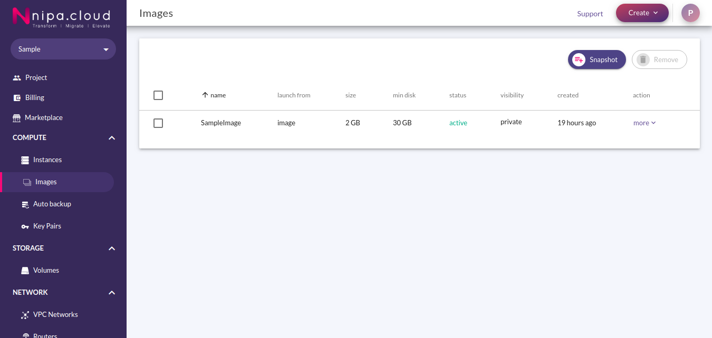
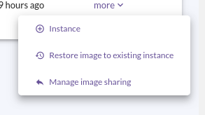
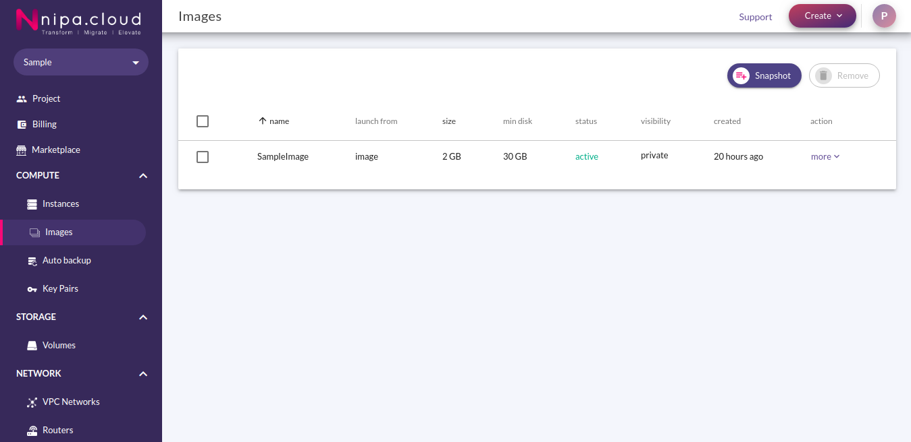
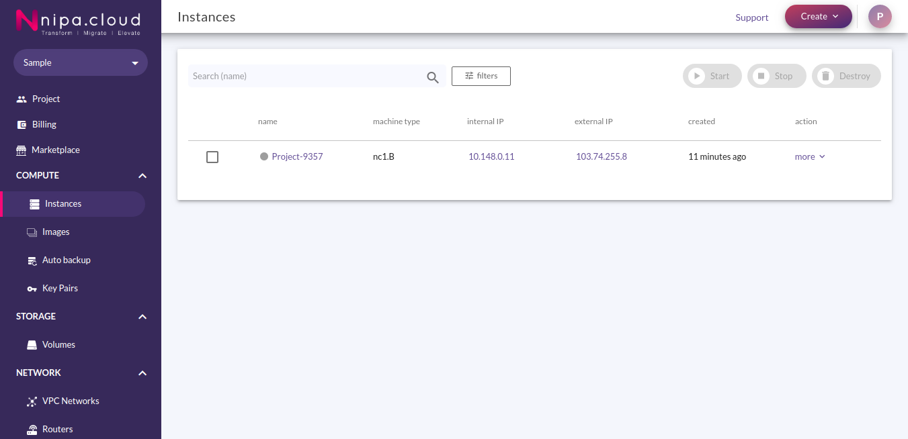
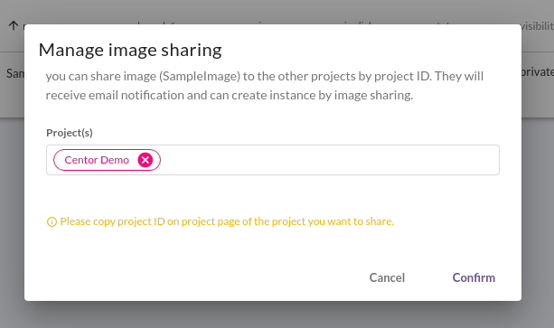
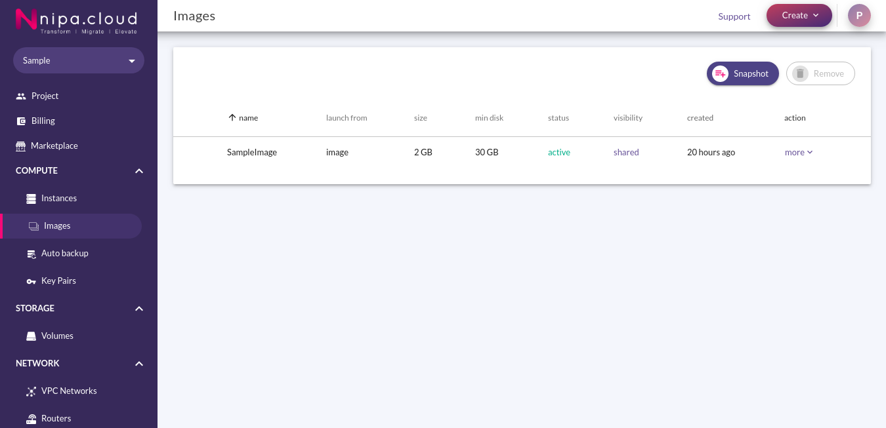
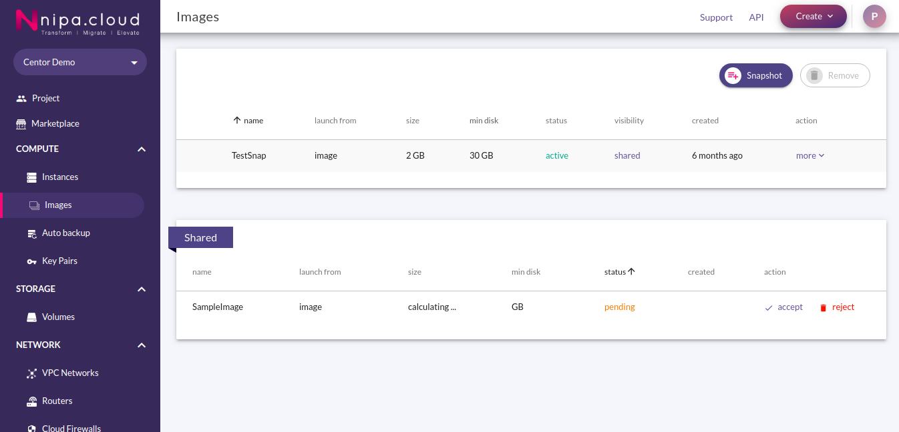
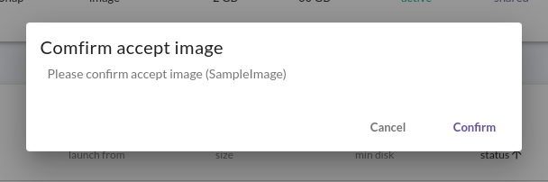
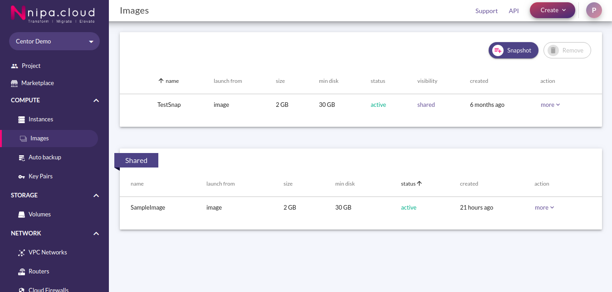

# Images Management

## Restore Image

เมื่อเราต้องการเอา Image ที่มีอยู่ ไป Build บน Instance ตัวเดิม เพื่อเป็นการเปลี่ยน OS หรืออื่นๆ โดยไม่ต้องตั้งค่า IP, Port, Network, ฯลฯ ใหม่ สามารถทำได้โดยการใช้คำสั่ง Restore Image ซึ่งก็จะคล้ายกับการ Rebuild Instance \(ดูได้ที่ [Instances Management](../instances/instances-management.md#rebuild)\) โดยการ Restore Image มีขั้นตอนดังนี้

1.เมื่อ Login เข้ามาใน NCP ให้คลิกที่ Images ภายใต้กลุ่ม Storage ที่ Sidebar เพื่อเข้าสู่หน้า Image

2.กดที่ More หลัง Image ที่ต้องการ Build ทับลงไปที่ Instance เพื่อเปิด Image Menu

3.กดที่ Restore Image to Existing Instance เพื่อเข้าสู่ Restore Image Page

4.เลือก Instance ที่ต้องการทำการ Restore โดยจะต้องเป็น Shutoff Instance เท่านั้น \(ดูการ Stop Instance ได้ที่ [Instances Management](../instances/instances-management.md#stop)\) จากนั้นกด Restore แล้วระบบจะพากลับมาที่ Images Page

5.คลิกที่ Instances ภายใต้กลุ่ม Compute ที่ Sidebar เพื่อเข้าสู่ Instances Page จะเห็นว่า Instance ที่เลือกจะกำลังดำเนินการอยู่ รอจนกว่าจุดแสดงสถานะ Instance จะกลายเป็นสีเทา

6.ทำการ Start Instance \(ดูการ start instance ได้ที่ [Instances Management](../instances/instances-management.md#start)\) และกลับมาใช้งานได้ทันที

## Share Image

เมื่อเราสร้าง Image ตัวหนึ่งขึ้นมา แล้วต้องการใช้ร่วมกันกับ User อื่น สามารถทำได้ 2 วิธี คือการเพิ่ม User นั้น เข้ามาใน Project เดียวกัน แต่หากไม่ต้องการใช้งาน Project ร่วมกัน สามารถทำได้โดยการ Share Image โดยมีขั้นตอนดังนี้

### Sender


image ที่ share จะยังเป็นของ Project ที่สร้างอยู่ แต่สามารถเข้าถึงได้โดย Project ที่ Share ให้ได้ ซึ่งหมายความว่า หากผู้สร้างลบ Image นี้ทิ้ง Project อื่นๆก็จะมองไม่เห็น Image นั้นอีกต่อไป


1.เมื่อ Login เข้ามาใน NCP ให้คลิกที่ Images ภายใต้กลุ่ม Storage ที่ Sidebar เพื่อเข้าสู่หน้า Image

2.กดที่ More หลัง Image ที่ต้องการ Share เพื่อเปิด Image Menu

3.กดที่ Manage Image Sharing เพื่อเข้าสู่ Manage Image Sharing Page

4.ที่ช่อง Project\(s\) ให้ใส่ Project ID ของ ผู้รับ Share \(ดูได้จาก Project Page\) แล้วกด Enter โดยสามารถ Share ได้มากกว่า 1 Project และกด Confirm เพื่อ Share ระบบจะพากลับไปที่ Images Page พร้อม Visibility ของ image ที่ Share จะกลายเป็น Shared

### Receiver

1.เมื่อ Login เข้ามาใน NCP ให้คลิกที่ Images ภายใต้กลุ่ม Storage ที่ Sidebar เพื่อเข้าสู่ Image Page

2.กด Accept ที่ Image ในหมวด Shared เพื่อเข้า Confirm Accept Image Page

3.กดปุ่ม Confirm เพื่อรับการ share ระบบจะพากลับไปที่ Images Page พร้อมแสดงสถานะของ Image ที่รับมาเป็น Active

