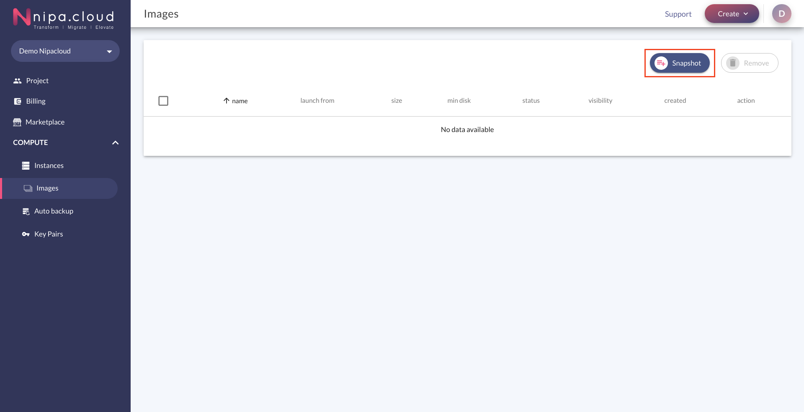
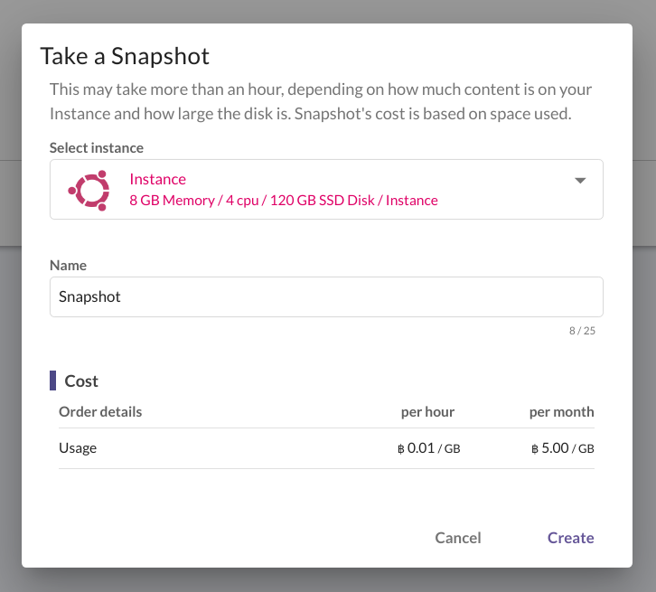
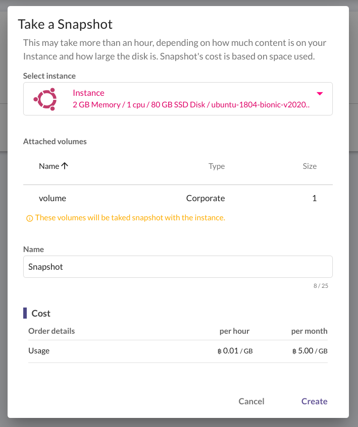
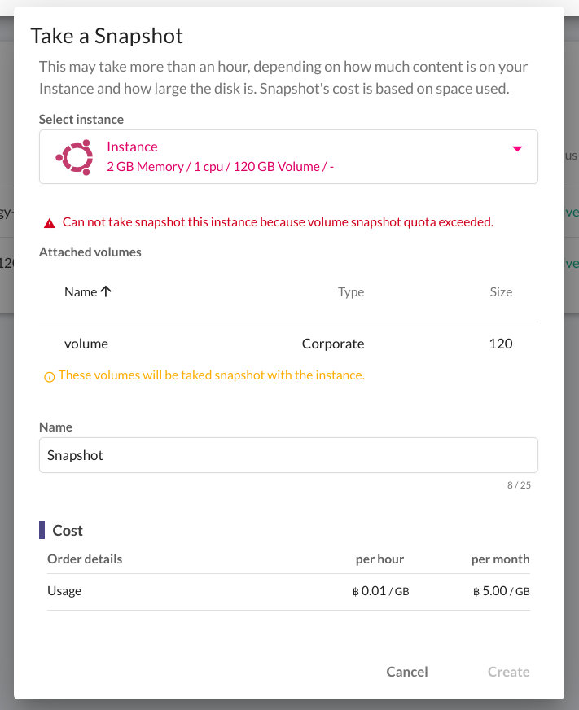
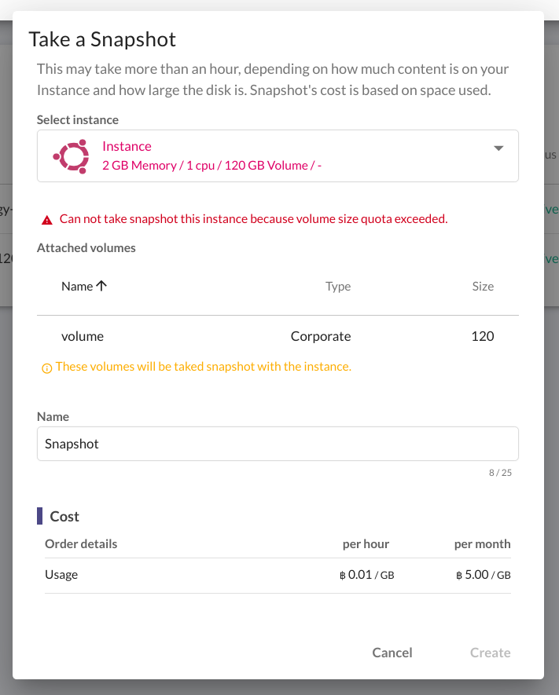
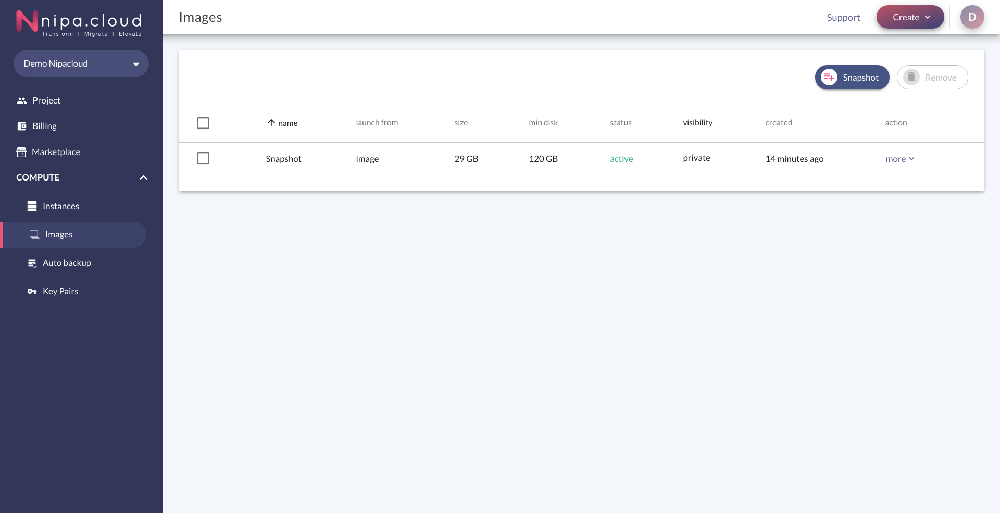
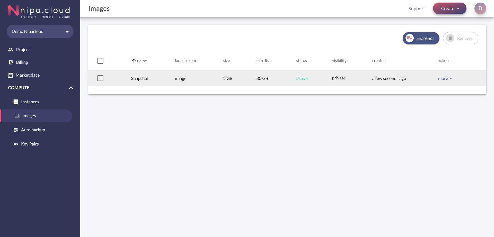
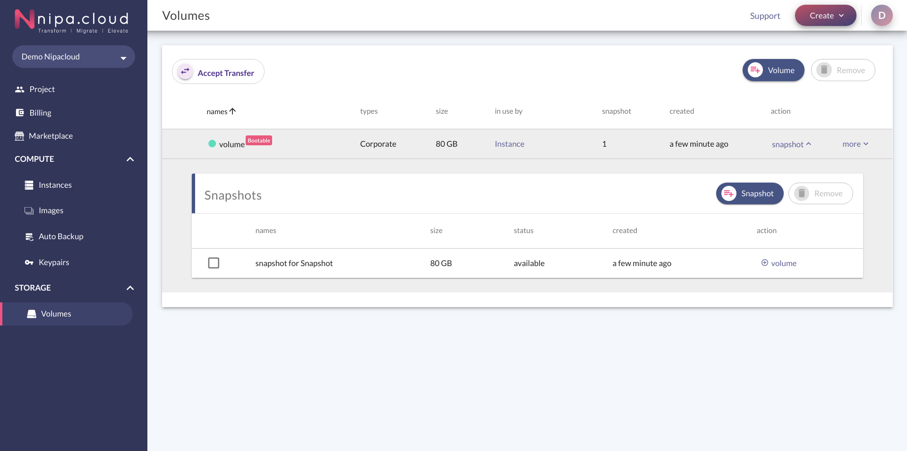

# Take Snapshot

Snapshot คือ การที่ผู้ใช้งานบันทึกการตั้งค่า หรือข้อมูลใดๆ ของ Instance ที่ใช้งาน ณ ขณะนั้น เพื่อนำ Instance ที่ Snapshot ไว้ไปใช้ในการสร้าง Instance เครื่องใหม่ หรือแชร์ให้กับผู้ใช้งานคนอื่นๆใช้ในการสร้าง Instance เครื่องใหม่ได้ โดยขั้นตอนการ Snapshot จะถูกเรียกว่า Take Snapshot ซึ่งจะแตกต่างจาก Auto Backup คือ Auto Backup จะดำเนินการทำโดยระบบ แต่ Snapshot ผู้ใช้งานจะสามารทำได้ด้วยตนเอง ซึ่งมีขั้นตอน ดังนี้

1.คลิกปุ่ม Snapshot

2.ระบบจะแสดง popup ขึ้นมา ให้ผู้ใช้งานกรอกข้อมูลที่ต้องการ Snapshot โดย

* Select instance: เลือก Instance ที่ต้องการ Take Snapshot
* Name: ชื่อของ Snapshot


ในการเลือก Instance ที่ต้องการ Take Snapshot หาก Instance เครื่องที่เลือกมี Volume ผูกติดอยู่ ระบบจะแสดงตารางรายละเอียด Volume ที่ผูกติดอยู่ให้ผู้ใช้งานทราบ เนื่องจากระบบจะทำการ Snapshot Volume ที่ผูกติดกับ Instance เครื่องนั้นๆด้วย  โดยถ้าพื้นที่การใช้งาน หรือ จำนวนการใช้งานของ Volume หรือ Snapshot Volume มีไม่เพียงพอจะไม่สามารถ Take Snapshot ได้ ผู้ใช้งานจะต้องทำการติดต่อ Administrator เพื่อร้องขอ Quota เพิ่ม ดังรูป


เมื่อกรอกข้อมูลเสร็จเรียบร้อยแล้ว ให้คลิก Create

3.หลังจากคลิก Create เรียบร้อยแล้ว ระบบจะทำการ Take Snapshot Instance เครื่องที่ผู้ใช้งานเลือก

ในกรณี ที่ Instance มี Volume ผูกติดอยู่จะแสดงผล ดังรูป


ในขั้นตอนนี้หากเครื่อง Instance ของผู้ใช้งานมีขนาดใหญ่ อาจจะใช้เวลาสักระยะหนึ่ง เพื่อให้ระบบจัดการ Take Snapshot โดยในการ Take Snapshot จะสามารถทำได้ครั้งละ 1 เครื่องเท่านั้น และการ Take Snapshot ของแต่ละ Project เริ่มต้นจะจำกัดให้ Snapshot ได้ 10 ครั้ง หากผู้ใช้งานต้องการ Snapshot เพิ่ม จะต้องร้องขอมายัง Administrator เพื่อเปิดใช้งานเพิ่ม


