# Instances Management

## Stop

เมื่อไม่ต้องการใช้งาน Instance แต่ยังไม่ต้องการลบ Instance ตัวนั้นทั้ง หรือต้องการทำ Operation อื่นๆ ที่ทำได้เฉพาะตอนที่ Instance อยู่ในสถานะ Shutoff สามารถทำการ Shutoff Instance ด้วยคำสั่ง Stop ได้ โดยมีขั้นตอนดังนี้

1.เมื่อ Login เข้ามาใน NCP จะพบกับ Instance Page ให้เลือก Instance ที่ต้องการ stop

2.ที่ Instance Detail Page ให้เลือกที่ Power Tab เพื่อเข้าสู่ Power Page

3.ที่ Power Page ให้กดปุ่ม Stop เพื่อเข้า Stop Instance Page

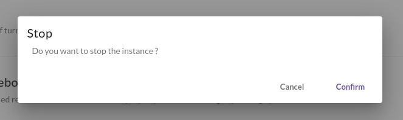

4.กดที่ปุ่ม "Confirm" เพื่อ Stop Instance

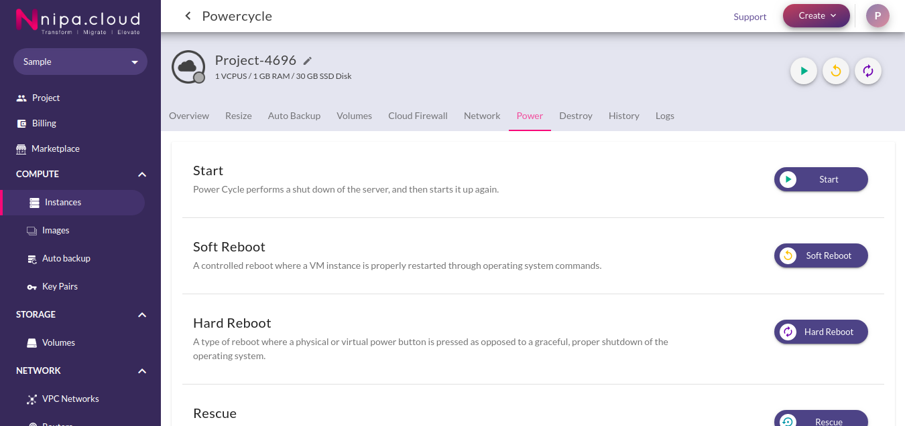

## Start

เมื่อต้องการกลับมาใช้งาน Instance ที่อยู่ในสถานะ Shutoff ทำได้โดยการสั่ง Start Instance โดยมีขั้นตอนดังนี้

1.เมื่อ Login เข้ามาใน NCP จะพบกับ Instance Page ให้เลือก Instance ที่ต้องการ Start

2.ที่ Instance Detail Page ให้เลือกที่ Power Tab เพื่อเข้าสู่ Power Page

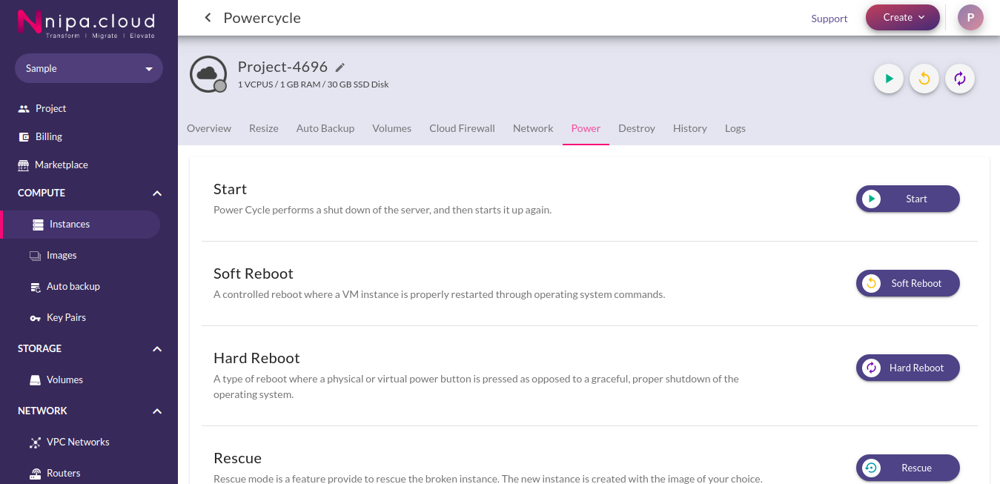

3.กดที่ปุ่ม Start เพื่อเข้า Start Instance Page

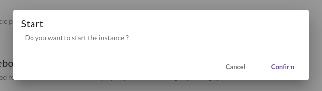

4.กดที่ปุ่ม Confirm เพื่อเริ่มใช้งาน Instance

## Soft Reboot

เมื่อต้องการ Reboot Instance ด้วย Command ของ OS สามารถทำได้โดยการสั่ง Soft Reboot โดยมีขั้นตอนดังนี้

1.เมื่อ Login เข้ามาใน NCP จะพบกับ Instance Page ให้เลือก Instance ที่ต้องการทำ Soft reboot

2.ที่ Instance Detail Page ให้เลือกที่ Power Tab เพื่อเข้าสู่ Power Page

3.กดที่ปุ่ม Soft Reboot เพื่อเข้าสู่ Soft Reboot Page

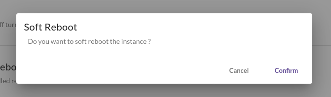

4.กดที่ปุ่ม Confirm เพื่อเริ่มการ Soft Reboot ระบบจะใช้เวลาสักครู่หนึ่ง เมื่อเสร็จแล้วจะเห็นจุดสีเขียว แสดงสถานะ Active ของ Instance

## Hard Reboot

เมื่อต้องการ Reboot Instance ที่ตัวเครื่อง physical สามารถทำได้โดยการสั่ง Hard Reboot โดยมีขั้นตอนดังนี้

1.เมื่อ Login เข้ามาใน NCP จะพบกับ Instance Page ให้เลือก Instance ที่ต้องการทำ Hard reboot

2.ที่ Instance Detail Page ให้เลือกที่ Power Tab เพื่อเข้าสู่ Power Page

3.กดที่ปุ่ม Hard Reboot เพื่อเข้าสู่ Hard Reboot Page

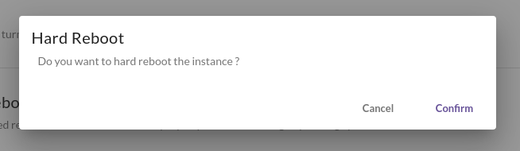

4.กดที่ปุ่ม Confirm เพื่อเริ่มการ Hard Reboot ระบบจะใช้เวลาสักครู่หนึ่ง เมื่อเสร็จแล้วจะเห็นจุดสีเขียว แสดงสถานะ Active ของ Instance

## Rescue

เมื่อ Instance เกิดปัญหากับ OS ทำให้เข้าใช้งานไม่ได้ แต่ต้องการเข้าไปกู้ข้อมูลที่อยู่ภายใน สามารถทำได้โดยการสั่ง Rescue โดยคำสั่งนี้ ระบบจะทำการ Mount OS เปล่าเข้าไป เพื่อให้สามารถเข้าถึงข้อมูลภายใน Instance ได้ โดยมีขั้นตอนดังนี้

1.เมื่อ Login เข้ามาใน NCP จะพบกับ Instance Page ให้เลือก Instance ที่ต้องการทำ Rescue

2.กดที่ปุ่ม Rescue เพื่อเข้า Rescue Page

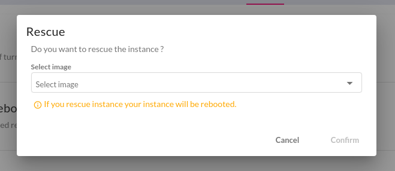

3.ที่ Select Image ให้เลือก Image ที่ต้องการใช้ในการ Mount เพื่อ Rescue Instance นี้ แล้วกดที่ปุ่ม Confirm เพื่อเริ่มทำ Mount Image ที่เลือกเข้าไปที่ Instance ระบบจะใช้เวลาสักครู่นึง เมื่อเสร็จแล้วจะเห็นจุดสีเหลืองแสดงสถานะ Rescue ของ Instance

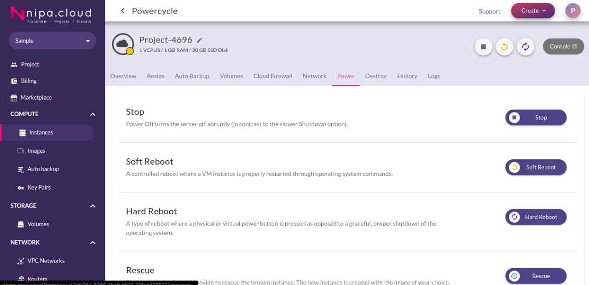

4.เข้าใช้งาน Instance ได้ตามปกติ ผ่าน Rescue OS ที่ Mount ลงไป

## Clean Install

เมื่อใช้งาน Instance ไปได้สักพักนึง ก็อาจเกิดปัญหาบางอย่างขึ้น ที่ไม่สามารถแก้ไขได้ หรือแก้ไขได้ยาก การสร้าง Instance ใหม่ตั้งแต่ต้นเลยอาจจะดีกว่า แต่ก็จะต้องเสียเวลาย้าย IP, Port, Network, ฯลฯ ที่เคยใช้งานใน Instance ตัวเดิม ไปยัง Instance ตัวใหม่อีก ทางออกนึงของปัญหานี้ก็คือการใช้ feature Clean Install ที่จะเป็นการล้าง Instance ให้กลับไปเป็นเหมือนตอนสร้างขึ้นมาใหม่นั่นเอง โดยมีขั้นตอนดังนี้

1.เมื่อ Login เข้ามาใน NCP จะพบกับ Instance Page ให้เลือก Instance ที่ต้องการทำ Clean Install

2.Stop Instance ตามวิธีการด้านบน [Instance Operation](instances-management.md#stop)

3.ที่ Instance Detail Page ให้เลือกที่ Power Tab เพื่อเข้าสู่ Power Page และเลื่อนลงมาด้านล่างจะพบปุ่ม Clean Install

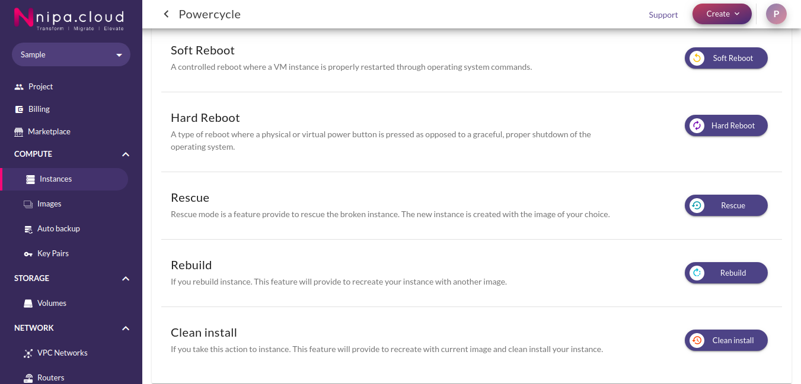

4.กดที่ปุ่ม Clean Install เพื่อเข้า Clean Install Page

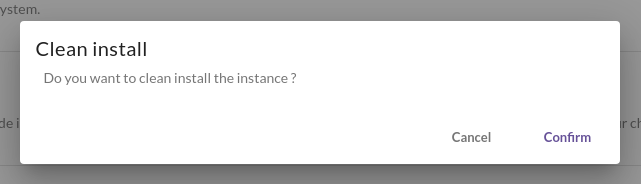

5.กดที่ปุ่ม "Confirm" เพื่อเริ่มทำ Clean Install ระบบจะใช้เวลาสักครู่นึง เมื่อเสร็จแล้วจะเห็นจุดสีเทาแสดงสถานะของ Instance

6.Start Instance ตามวิธีด้านบน [Instance Operation](instances-management.md#start) และใช้งานต่อได้เลย

## Rebuild

เมื่อเราต้องการเปลี่ยน OS ของ Instance หรือต้องการ Instance ที่มี Image ตัวอื่น แต่ด้วย Config, Spec, IP, Port, Network, ฯลฯ เดิม เราไม่จำเป็นจะต้อง Launch Instance ขึ้นมาใหม่แล้ว Setting ใหม่ทั้งหมด เราสามารถใช้ Feature Rebuild เพื่อ Build Image ใหม่ ไปที่ Instance ตัวเดิมได้ โดยมีขั้นตอนดังนี้

1.เมื่อ Login เข้ามาใน NCP จะพบกับ Instance Page ให้เลือก Instance ที่ต้องการทำ Clean Install

2.Stop Instance ตามวิธีการด้านบน [Instance Operation](instances-management.md#stop)

3.ที่ Instance Detail Page ให้เลือกที่ Power Tab เพื่อเข้าสู่ Power Page และเลื่อนลงมาด้านล่างจะพบปุ่ม Rebuild

4.กดที่ปุ่ม Rebuild เพื่อเข้า Rebuild Page

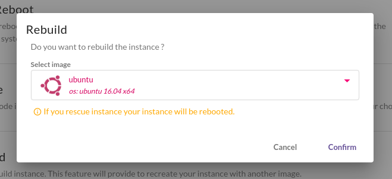

5.ที่ Select Image ให้เลือก Image ใหม่ที่ต้องการ Build ลงไปใน Instance นี้ แล้วกดที่ปุ่ม Confirm เพื่อเริ่มทำ Rebuild ระบบจะใช้เวลาสักครู่นึง เมื่อเสร็จแล้วจะเห็นจุดสีเทาแสดงสถานะของ Instance

6.Start Instance ตามวิธีด้านบน [Instance Operation](instances-management.md#start) และใช้งานต่อได้เลย

## Resize

เมื่อเราสร้าง Instance มาแล้ว ทำงานไปได้สักพักนึง ความต้องการของระบบอาจจะมากขึ้น RAM, CPU ไม่พอ การที่จะ launch Instance ขึ้นมาใหม่แล้วถ่ายโอนทุกอย่างไปก็คงจะเป็นเรื่องยาก อีกวิธีหนึ่งที่ช่วยได้ก็คือการ Resize ที่จะเพิ่มขนาดและประสิทธิภาพของ Instance โดยไม่ต้องสร้างใหม่ โดยมีวิธีการดังนี้

1.เมื่อ Login เข้ามาใน NCP จะพบกับ Instance Page ให้เลือก Instance ที่ต้องการทำ Resize

2.Stop Instance ตามวิธีการด้านบน [Instance Operation](instances-management.md#stop)

3.ที่ Instance Detail Page ให้เลือกที่ Resize Tab เพื่อเข้าสู่ Resize Page

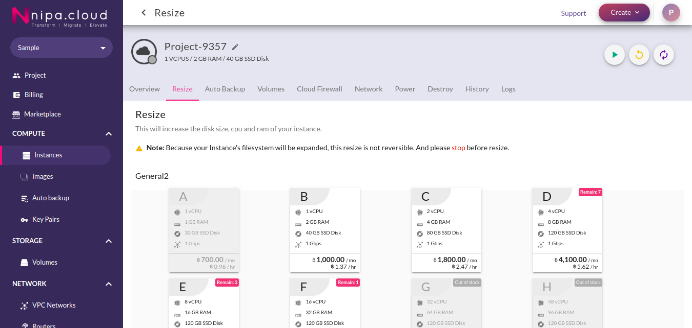

4.เลือก Spec ใหม่ที่ต้องการ แล้วกดปุ่ม Resize ที่ด้านล่างเพื่อเข้าสู่ Confirm Resize Page

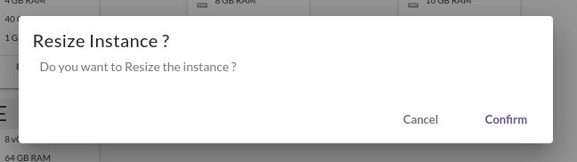

5.กดปุ่ม Confirm เพื่อทำการ Resize ระบบจะใช้เวลาสักครู่ เมื่อเสร็จแล้วระบบจะพากลับไปที่ Resize Page พร้อมแสดง Spec ใหม่ และสถานะของ Instance เป็นสีเทา

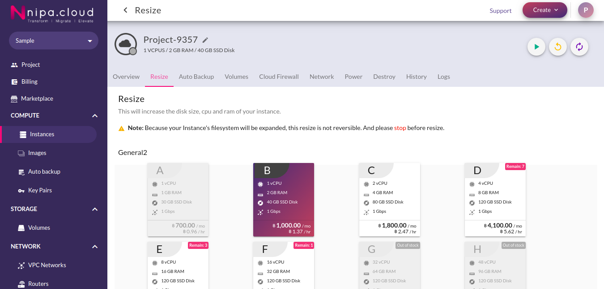

6.Start Instance ตามวิธีด้านบน [Instance Operation](instances-management.md#start) และใช้งานต่อได้เลย

## Attach Volume

เมื่อเราใช้งาน Instance ไปได้สักพักหนึ่ง ความต้องการระบบก็อาจจะเพิ่มขึ้น นอกจากการ Resize \(ดูการ Resize [Instances Management](instances-management.md#resize)\) ที่เพิ่ม RAM, CPU, ROM แล้ว เรายังสามารถเพิ่ม SSD storage เข้าไปที่ Instance เข้าเราได้ โดยการ Attach Volume โดยมีขั้นตอนดังนี้

1.เมื่อ Login เข้ามาใน NCP จะพบกับ Instance Page ให้เลือก Instance ที่ต้องการ Attach Volume

2.ที่ Instance Detail Page ให้เลือกที่ Volumes Tab เพื่อเข้าสู่ Attach Volume Page

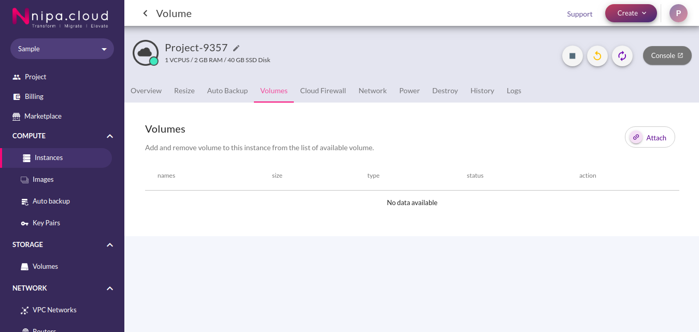

3.กดปุ่ม Attach เพื่อเข้า Confirm Attach Volume Page

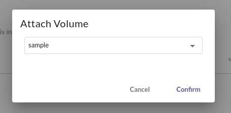

4.เลือก Volume ที่ต้องการ \(หากไม่มี สามารถสร้างได้โดยมีขั้นตอนดังนี้ [Volumes Management](../storages/volumes-management.md#create-volume)\) แล้วกด Confirm เพื่อทำการ Attach เมื่อเสร็จแล้ว ระบบจะพากลับมาที่ Attach Volume Page โดยจะเห็นว่ามี Volume เพิ่มขึ้นมาก็เป็นอันเสร็จ

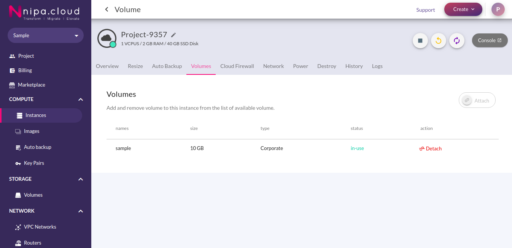

## Detach Volume

เมื่อเราต้องการ launch Instance ใหม่ เพื่อเปลี่ยนแปลงระบบ แต่ยังต้องการใช้ Volume ตัวเดิม เราก็จะต้อง Detach Volume ตัวนั้น ออกจาก Instance ตัวเก่าก่อน โดยมีขั้นตอนดังนี้

1.เมื่อ Login เข้ามาใน NCP จะพบกับ Instance Page ให้เลือก Instance ที่ต้องการ Detach volume

2.ที่ Instance Detail Page ให้เลือกที่ Volumes Tab เพื่อเข้าสู่ Attach Volume Page

3.ที่ Volume ที่ต้องการ Detach ให้กดที่ปุ่ม Detach ด้านขวา เพื่อเข้าสู่ Confirm Detach Volume Page

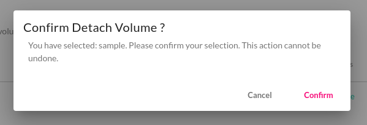

4.กดที่ปุ่ม Confirm เพื่อทำการ Detach Volume เมื่อเสร็จแล้ว ระบบจะพากลับไปที่ Attach Volume Page โดย Volume ที่เคย Attach อยู่จะหายไป

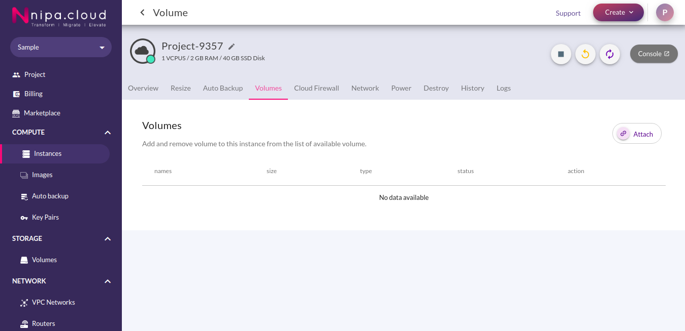

## Manage Cloud Firewall

การใช้งาน instance บน cloud ที่เชื่อมต่ออยู่กับ External IP เชื่อมต่อกับโลกภายนอก อาจมีความเสี่ยงที่จะถูกโจมตี หรือถูกเข้ามาขโมยข้อมูลสำคัญไปได้ แต่เราสามารถจำกัดการเข้าถึง เพื่อลดความเสี่ยงเหล่านั้นได้ โดยการใช้ Cloud Firewall ซึ่งทำได้ตามขั้นตอนต่อไปนี้

1.เมื่อ Login เข้ามาใน NCP จะพบกับ Instance Page ให้เลือก Instance ที่ต้องการจัดการ Cloud Firewall

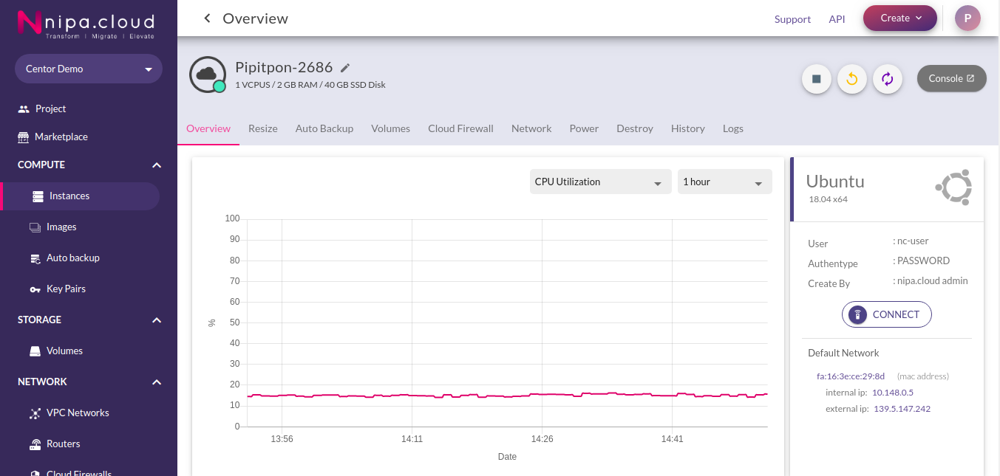

2.ที่ Instance Detail Page ให้เลือกที่ Cloud Firewall Tab เพื่อเข้าสู่ Manage Port Cloud Firewall Page

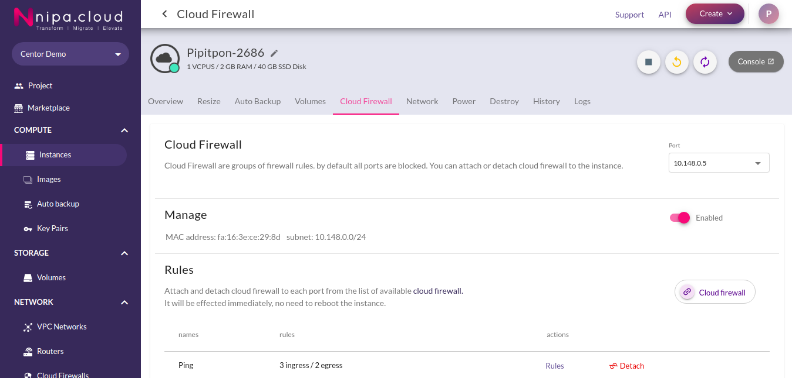

3.Instance หนึ่ง สามารถเชื่อมกับ Port ได้มากกว่า 1 Port เราสามารถเลือกจัดการ Cloud Firewall ของแต่ละ Port แยกกันได้ โดยการเลือก Port จากตัวเลือกในช่อง Cloud Firewall และแต่ละ Port สามารถเปิดปิด Cloud Firewall ได้ที่ตัวเลือกในช่อง Manage

4.การเพิ่ม Cloud Firewall ไปที่ Port ที่เลือกอยู่ทำได้โดยกดที่ปุ่ม Cloud Firewall ในช่อง Rules เพื่อเข้า Attach Cloud Firewall Page

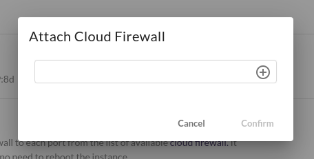

5.เลือก Cloud Firewall ที่ต้องการเพิ่มไปที่ Port แล้วกด Confirm ระบบจะพากลับมาที่ Manage Port Cloud Firewall Page พร้อมแสดง Cloud Firewall ที่มีอยู่

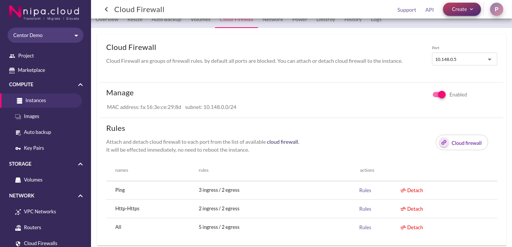

6.หากต้องการเอา Cloud Firewall ออกจาก Port ก็ทำได้โดยการกด Detach หลัง Cloud Firewall ที่ต้องการเอาออก เพื่อเข้าสู่ Confire Detach Firewall Instance Page

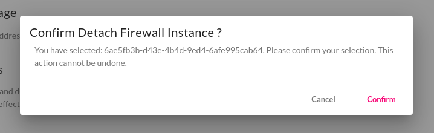

7.กดที่ปุ่ม Confirm เพื่อ Detach Cloud Firewall ระบบจะพากลับมาที่ Manage Port Cloud Firewall Page พร้อมแสดง Cloud Firewall ที่เหลืออยู่

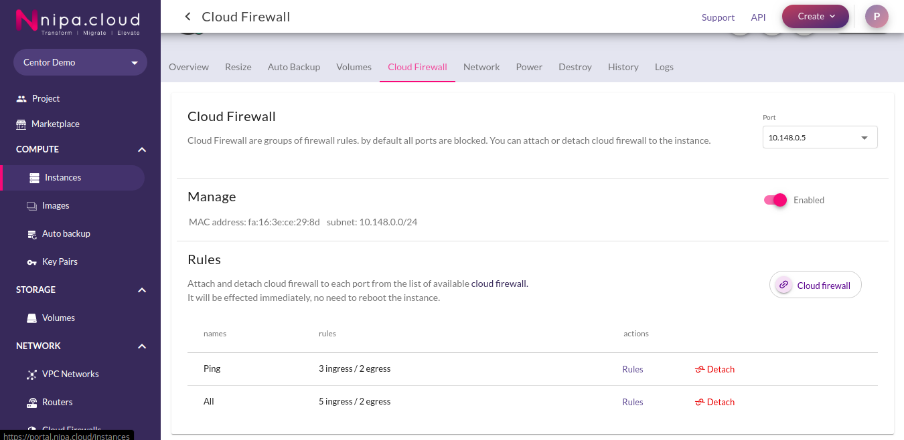

## Manage Auto Backup

เมื่อเราใช้งาน Instance ไปเป็นระยะเวลาหนึ่ง แล้วเกิดปัญหาที่ทำให้ไม่สามารถใช้งานต่อไปได้ หากเรามีการทำ Snapshot ไว้ ก็สามารถเอา Snapshot นั้นมาสร้าง Instance ใหม่ใช้ได้ แต่หากไม่มีจะทำยังไง ใน Nipa.Cloud เราพร้อมรับมือกับปัญหาแบบนี้อยู่แล้ว เราจึงมี Auto Backup ซึ่งคอยช่วยบันทึก State ของ Instance สำหรับกู้คืนไว้ให้อัตโนมัติ โดยสามารถจัดการกับ Auto Backup ได้ดังนี้

1.เมื่อ Login เข้ามาใน NCP จะพบกับ Instance Page ให้เลือก Instance ที่ต้องการจัดการ Auto Backup

2.ที่ Instance Detail Page ให้เลือกที่ Auto Backup Tab เพื่อเข้าสู่ Manage Auto Backup Page

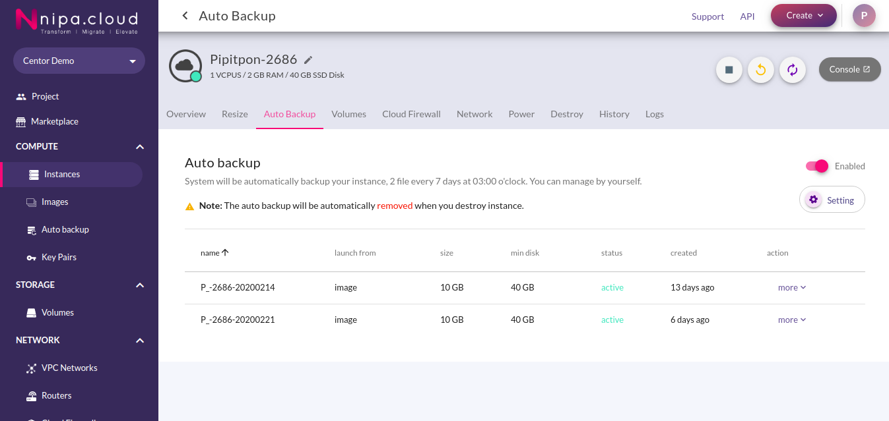

3.โดยปกติ feature นี้จะถูกเปิดให้อัตโนมัติสำหรับทุก Project แต่ก็สามารถปิดได้ โดยปรับ Auto Backup Enable เป็น Disable ระบบจะแสดง Confirm Disable Auto Backup Page

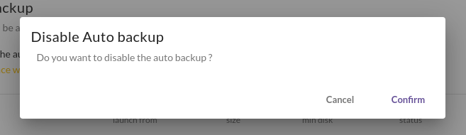

4.กดที่ Confirm เพื่อปิดการทำงาน Auto Backup ระบบจะพากลับไปที่ Manage Auto Backup Page พร้อมแสดงสถานะเป็น Disable

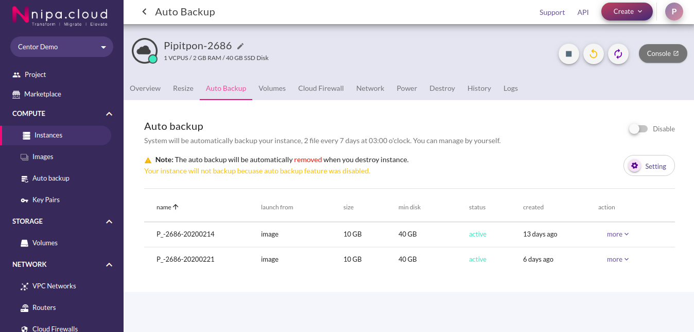

5.ในกรณีที่ต้องการใช้งาน Auto Backup แต่ต้องการแก้ไขเวลาที่ทำการ Backup และจำนวนของ Backup สามารถทำได้โดยการกดที่ปุ่ม Setting เพื่อเข้าสู่ Auto Backup Setting Page

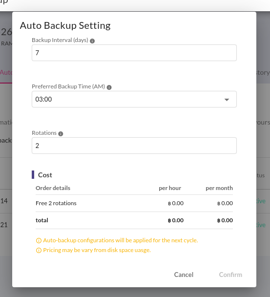

6.ใส่ข้อมูลดังต่อไป

* Backup Interval \(days\): จำนวนวันที่ระบบจะทำการ Backup 
* Preferred Backup Time \(AM\): เวลาที่จะทำการ Backup
* Rotations: จำนวนของ Backup ที่จะทำการเก็บไว้

เมื่อใส่ข้อมูลครบถ้วนแล้ว ให้กด Confirm ระบบจะพากลับไปที่ Manage Auto Backup Page เป็นอันเสร็จสิ้น


Setting เหล่านี้จะมีผลในรอบการทำงานต่อไป



จำนวน Rotations ที่มากกว่า 2 จะถูกคิดเงิน โดยราคาจะเป็นไปตามขนาดของ Backup File


## Attach Network

เมื่อสร้าง Instance ขึ้นมา จะมี Network Port แค่ Port เดียวเท่านั้น แต่ในการใช้งานจริง เราอาจต้องการมากกว่านั้น ซึ่งเราสามารถเพิ่ม Network Port ได้โดยการ Attach Network โดยมีขั้นตอนดังนี้

1.เมื่อ Login เข้ามาใน NCP จะพบกับ Instance Page ให้เลือก Instance ที่ต้องการ Attach Network เพิ่ม

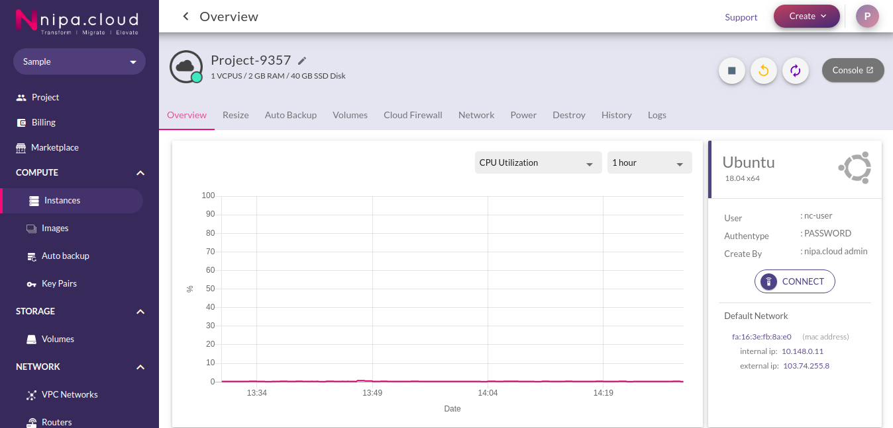

2.ที่ Instance Detail Page ให้เลือกที่ Network Tab เพื่อเข้าสู่ Network Page

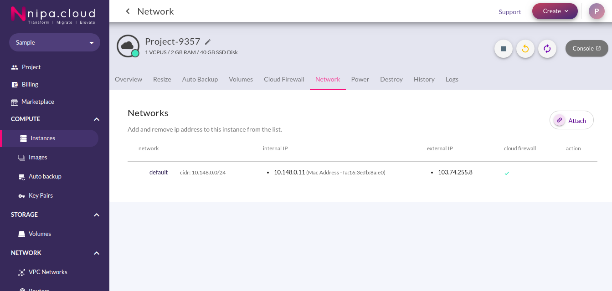

3.กดที่ปุ่ม Attach เพื่อเข้า Attach Network Page

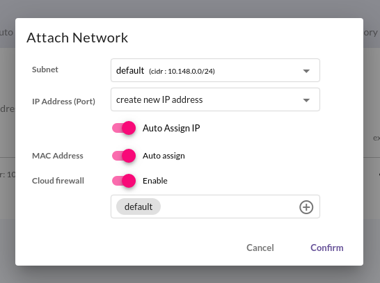

4.ใส่ข้อมูลดังต่อไปนี้

* Subnet: เลือก Subnet สำหรับ Port ที่ต้องการ Attach
* IP Address\(Port\): เลือก Port IP ที่ต้องการ หรือหากต้องการสร้าง Port ใหม่ ให้เลือก "create new IP address"
* Auto Assign IP: ในกรณีที่เลือกสร้าง Port ใหม่ สามารถเลือก IP เองได้ แต่หากต้องการให้ระบบตั้งให้ ให้เลือก Auto Assign IP
* MAC Address: สามารถกำหนัด MAC Address เอง หรือให้ระบบตั้งให้ได้
* Cloud Firewall: เปิดหรือปิด Cloud Firewall สำหรับ Port นี้ หากเปิด ก็สามารถใส่ Cloud Firewall ที่ต้องการได้เลย

เมื่อใส่ข้อมูลครบถ้วนแล้ว ให้กด Confirm ระบบจะพากลับไปที่ Instance Network Page พร้อมแสดง Port ที่ถูก Attach เข้ามาแล้ว

## Edit Name

เมื่อเราต้องการเปลี่ยนชื่อของ Instance เพื่อให้ง่ายต่อการจดจำ สามารถทำได้ตามขั้นตอนต่อไปนี้

1.เมื่อ Login เข้ามาใน NCP จะพบกับ Instance Page ให้เลือก Instance ที่ต้องการเปลี่ยนชื่อ

2.คลิกที่ชื่อของ Instance ที่อยู่ด้านบนของ Page เพื่อเข้าสู่ Edit Name Page

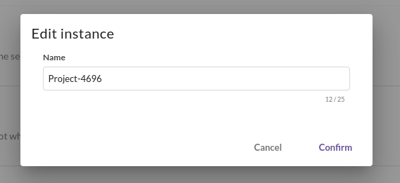

3.ที่ช่อง Name ใส่ชื่อใหม่ที่ต้องการตั้งให้ Instance นี้ แล้วกดที่ปุ่ม Confirm เพื่อทำการเปลี่ยนชื่อ Instance ระบบจะพากลับไปที่ Instance Detail Page และแสดงให้เห็นชื่อ Instance ที่เปลี่ยนไป

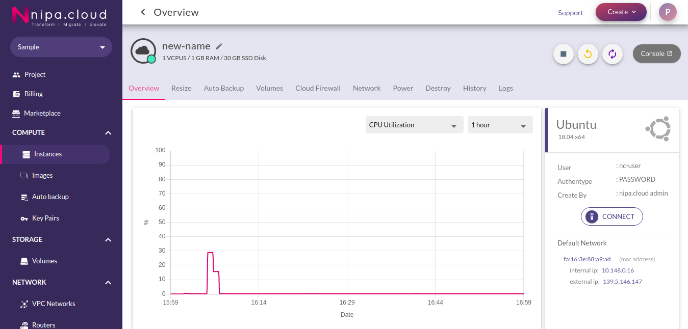

## Destroy Instance

เมื่อเราไม่ต้องการ Instance แล้ว ก็ควรทำการลบทิ้ง เพื่อไม่ให้ระบบเก็บเงินต่อไป โดยมีขั้นตอนดังนี้

1.เมื่อ Login เข้ามาใน NCP จะพบกับ Instance Page ให้เลือก Instance ที่ต้องการลบ

2.ที่ Instance Detail Page ให้เลือกที่ Destroy Tab เพื่อเข้าสู่ Destroy Page

3.กดที่ปุ่ม Destroy เพื่อเข้าสู่ Confirm Destroy Page

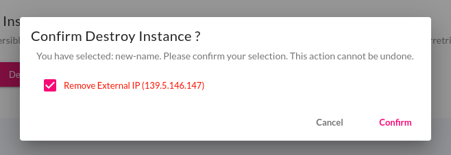

4.ในการลบ Instance เราสามารถลบ external IP ที่ผูกอยู่กับ Instance ตัวนี้ไปด้วยได้ โดยการเช็คที่ Remove External IP หรือหากต้องการเก็บไว้ ให้เอาเช็คออก ก่อนกด Confirm เพื่อทำการลบ Instance


เมื่อทำการลบ Instance แล้ว จะไม่สามารถู้คืนได้อีก หากต้องการเก็บข้อมูลใน Instance เอาไว้ ให้ลองศึกษาที่การ Create Snapshot เพื่อบันทึก State ของ Instance เอาไว้


