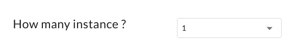
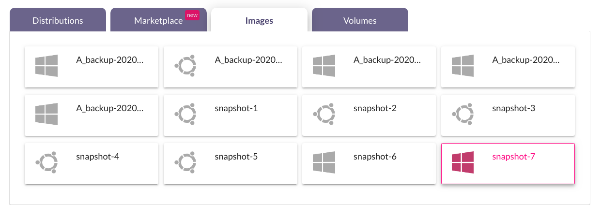
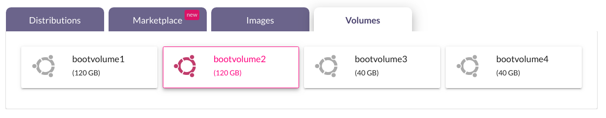
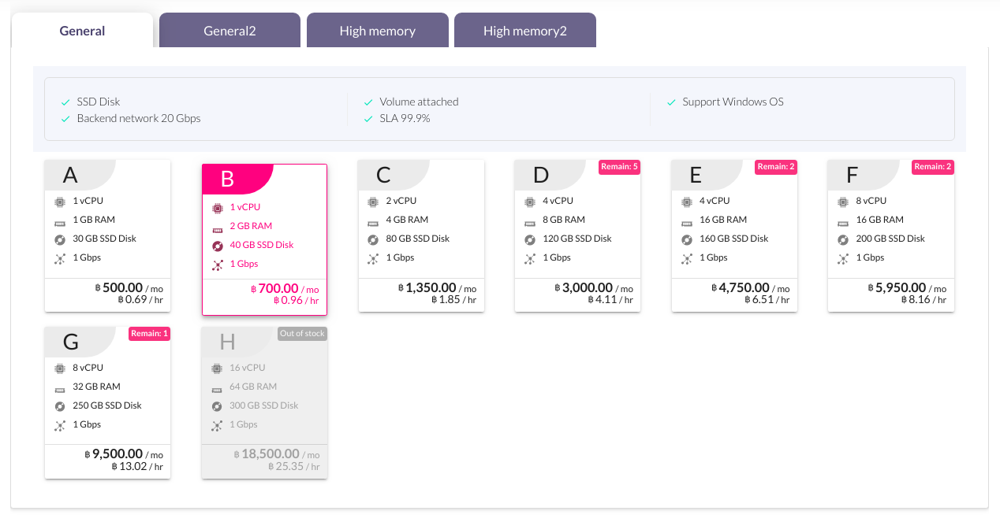
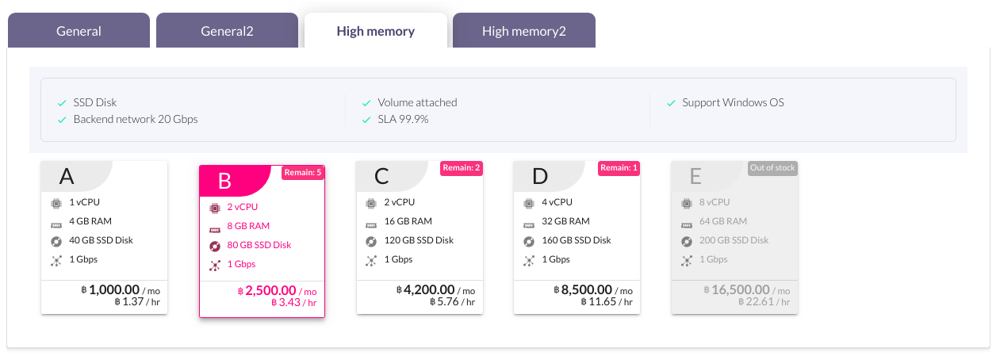
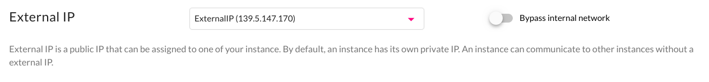
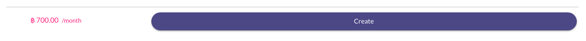
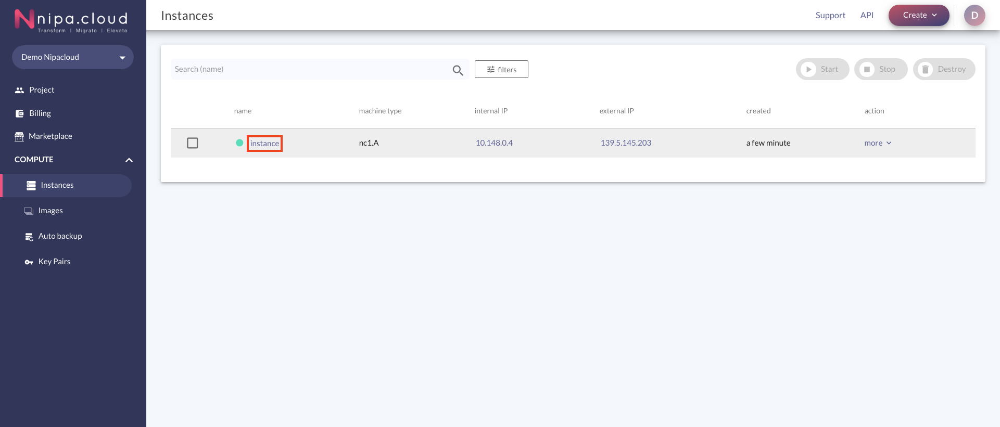

# Launch Instance

## ข้อมูลที่ใช้ในการสร้าง Instance

ในการสร้าง instance ควรทำความเข้าใจถึงข้อมูลต่างๆที่ใช้ในการสร้าง instance ก่อน ดังนี้

<table>
  <thead>
    <tr>
      <th style="text-align:left"><b>&#xE2B;&#xE31;&#xE27;&#xE02;&#xE49;&#xE2D;</b>
      </th>
      <th style="text-align:left"><b>&#xE04;&#xE33;&#xE2D;&#xE18;&#xE34;&#xE1A;&#xE32;&#xE22;</b>
      </th>
      <th style="text-align:center">Optional</th>
    </tr>
  </thead>
  <tbody>
    <tr>
      <td style="text-align:left">Hostname</td>
      <td style="text-align:left">&#xE0A;&#xE37;&#xE48;&#xE2D; instance</td>
      <td style="text-align:center"></td>
    </tr>
    <tr>
      <td style="text-align:left">Image</td>
      <td style="text-align:left">&#xE23;&#xE30;&#xE1A;&#xE1A;&#xE1B;&#xE0F;&#xE34;&#xE1A;&#xE31;&#xE15;&#xE34;&#xE01;&#xE32;&#xE23;
        (Operating System) &#xE02;&#xE2D;&#xE07; instance</td>
      <td style="text-align:center"></td>
    </tr>
    <tr>
      <td style="text-align:left">Machine Type</td>
      <td style="text-align:left">spec &#xE02;&#xE2D;&#xE07; instance (&#xE41;&#xE15;&#xE48;&#xE25;&#xE30;&#xE1B;&#xE23;&#xE30;&#xE40;&#xE20;&#xE17;&#xE21;&#xE35;&#xE08;&#xE33;&#xE19;&#xE27;&#xE19;&#xE08;&#xE33;&#xE01;&#xE31;&#xE14;
        &#xE2B;&#xE32;&#xE01; spec &#xE44;&#xE2B;&#xE19;&#xE40;&#xE2B;&#xE25;&#xE37;&#xE2D;&#xE19;&#xE49;&#xE2D;&#xE22;&#xE01;&#xE27;&#xE48;&#xE32;
        10 &#xE40;&#xE04;&#xE23;&#xE37;&#xE48;&#xE2D;&#xE07; &#xE08;&#xE30;&#xE41;&#xE2A;&#xE14;&#xE07;&#xE08;&#xE33;&#xE19;&#xE27;&#xE19;&#xE40;&#xE04;&#xE23;&#xE37;&#xE48;&#xE2D;&#xE07;&#xE17;&#xE35;&#xE48;&#xE40;&#xE2B;&#xE25;&#xE37;&#xE2D;&#xE44;&#xE27;&#xE49;
        &#xE41;&#xE25;&#xE30;&#xE1B;&#xE23;&#xE30;&#xE40;&#xE20;&#xE17;&#xE44;&#xE2B;&#xE19;&#xE17;&#xE35;&#xE48;&#xE2B;&#xE21;&#xE14;
        &#xE08;&#xE30;&#xE41;&#xE2A;&#xE14;&#xE07;&#xE02;&#xE49;&#xE2D;&#xE04;&#xE27;&#xE32;&#xE21;
        out of stock)</td>
      <td style="text-align:center"></td>
    </tr>
    <tr>
      <td style="text-align:left">Cloud firewall</td>
      <td style="text-align:left">
        
&#xE2A;&#xE48;&#xE27;&#xE19;&#xE17;&#xE35;&#xE48;&#xE23;&#xE30;&#xE1A;&#xE38;&#xE01;&#xE32;&#xE23;&#xE40;&#xE02;&#xE49;&#xE32;&#xE16;&#xE36;&#xE07;
          instance &#xE42;&#xE14;&#xE22;&#xE23;&#xE30;&#xE1A;&#xE1A;&#xE08;&#xE30;&#xE21;&#xE35;
          default cloud firewall &#xE43;&#xE2B;&#xE49; &#xE14;&#xE31;&#xE07;&#xE19;&#xE35;&#xE49;

        <ul>
          <li>All</li>
          <li>Rdp</li>
          <li>Http-Https</li>
          <li>default</li>
          <li>In-Cluster</li>
          <li>Ping</li>
          <li>SSH</li>
        </ul>
        
&#xE1C;&#xE39;&#xE49;&#xE43;&#xE0A;&#xE49;&#xE07;&#xE32;&#xE19;&#xE2A;&#xE32;&#xE21;&#xE32;&#xE23;&#xE16;&#xE2A;&#xE23;&#xE49;&#xE32;&#xE07;
          Cloud firewall &#xE40;&#xE1E;&#xE34;&#xE48;&#xE21;&#xE40;&#xE15;&#xE34;&#xE21;&#xE44;&#xE14;&#xE49;
          &#xE42;&#xE14;&#xE22;&#xE14;&#xE39;&#xE08;&#xE32;&#xE01;&#xE2B;&#xE31;&#xE27;&#xE02;&#xE49;&#xE2D;
          Create Cloud firewall

      </td>
      <td style="text-align:center"></td>
    </tr>
    <tr>
      <td style="text-align:left">Authentication</td>
      <td style="text-align:left">&#xE2A;&#xE48;&#xE27;&#xE19;&#xE17;&#xE35;&#xE48;&#xE01;&#xE33;&#xE2B;&#xE19;&#xE14;
        keypair &#xE2B;&#xE23;&#xE37;&#xE2D; password &#xE43;&#xE19;&#xE01;&#xE32;&#xE23;&#xE40;&#xE02;&#xE49;&#xE32;&#xE43;&#xE0A;&#xE49;&#xE07;&#xE32;&#xE19;
        &#xE42;&#xE14;&#xE22; keypair &#xE1C;&#xE39;&#xE49;&#xE43;&#xE0A;&#xE49;&#xE07;&#xE32;&#xE19;&#xE2A;&#xE23;&#xE49;&#xE32;&#xE07;&#xE40;&#xE1E;&#xE34;&#xE48;&#xE21;&#xE40;&#xE15;&#xE34;&#xE21;&#xE44;&#xE14;&#xE49;
        &#xE42;&#xE14;&#xE22;&#xE14;&#xE39;&#xE08;&#xE32;&#xE01;&#xE2B;&#xE31;&#xE27;&#xE02;&#xE49;&#xE2D;
        Create keypair</td>
      <td style="text-align:center"></td>
    </tr>
    <tr>
      <td style="text-align:left">How many instance</td>
      <td style="text-align:left">&#xE08;&#xE33;&#xE19;&#xE27;&#xE19; instance &#xE17;&#xE35;&#xE48;&#xE15;&#xE49;&#xE2D;&#xE07;&#xE01;&#xE32;&#xE23;&#xE2A;&#xE23;&#xE49;&#xE32;&#xE07;</td>
      <td
      style="text-align:center"></td>
    </tr>
    <tr>
      <td style="text-align:left">Instance Volume</td>
      <td style="text-align:left">&#xE02;&#xE19;&#xE32;&#xE14;&#xE02;&#xE2D;&#xE07; volume (&#xE2A;&#xE32;&#xE21;&#xE32;&#xE16;&#xE23;&#xE30;&#xE1A;&#xE38;&#xE44;&#xE14;&#xE49;&#xE43;&#xE19;&#xE01;&#xE23;&#xE13;&#xE35;&#xE17;&#xE35;&#xE48;&#xE40;&#xE25;&#xE37;&#xE2D;&#xE01;
        image &#xE41;&#xE1A;&#xE1A; Distributions, Marketplace &#xE2B;&#xE23;&#xE37;&#xE2D;
        Images &#xE41;&#xE25;&#xE30;&#xE2A;&#xE23;&#xE49;&#xE32;&#xE07;&#xE41;&#xE1A;&#xE1A;
        boot volume)</td>
      <td style="text-align:center">/</td>
    </tr>
    <tr>
      <td style="text-align:left">Network</td>
      <td style="text-align:left">&#xE2A;&#xE48;&#xE27;&#xE19;&#xE17;&#xE35;&#xE48;&#xE01;&#xE33;&#xE2B;&#xE19;&#xE14;
        network &#xE17;&#xE35;&#xE48;&#xE15;&#xE49;&#xE2D;&#xE07;&#xE01;&#xE32;&#xE23;&#xE43;&#xE0A;&#xE49;&#xE07;&#xE32;&#xE19;
        &#xE42;&#xE14;&#xE22;&#xE2A;&#xE32;&#xE21;&#xE32;&#xE23;&#xE16;&#xE01;&#xE33;&#xE2B;&#xE19;&#xE14;
        IP Address &#xE17;&#xE35;&#xE48;&#xE15;&#xE49;&#xE2D;&#xE07;&#xE01;&#xE32;&#xE23;&#xE43;&#xE0A;&#xE49;&#xE07;&#xE32;&#xE19;&#xE44;&#xE14;&#xE49;</td>
      <td
      style="text-align:center">/</td>
    </tr>
    <tr>
      <td style="text-align:left">External IP</td>
      <td style="text-align:left">&#xE2A;&#xE48;&#xE27;&#xE19;&#xE17;&#xE35;&#xE48;&#xE01;&#xE33;&#xE2B;&#xE19;&#xE14;
        IP Address &#xE17;&#xE35;&#xE48;&#xE43;&#xE0A;&#xE49;&#xE43;&#xE19;&#xE01;&#xE32;&#xE23;&#xE40;&#xE0A;&#xE37;&#xE48;&#xE2D;&#xE21;&#xE15;&#xE48;&#xE2D;
        instance &#xE01;&#xE31;&#xE1A; network &#xE20;&#xE32;&#xE22;&#xE19;&#xE2D;&#xE01;</td>
      <td
      style="text-align:center"></td>
    </tr>
    <tr>
      <td style="text-align:left">Auto Backup</td>
      <td style="text-align:left">&#xE2A;&#xE48;&#xE27;&#xE19;&#xE17;&#xE35;&#xE48;&#xE01;&#xE33;&#xE2B;&#xE19;&#xE14;&#xE16;&#xE36;&#xE07;&#xE01;&#xE32;&#xE23;&#xE43;&#xE2B;&#xE49;&#xE23;&#xE30;&#xE1A;&#xE1A;&#xE08;&#xE31;&#xE14;&#xE01;&#xE32;&#xE23;&#xE40;&#xE01;&#xE47;&#xE1A;&#xE02;&#xE49;&#xE2D;&#xE21;&#xE39;&#xE25;
        backup instance &#xE42;&#xE14;&#xE22;&#xE2D;&#xE31;&#xE15;&#xE42;&#xE19;&#xE21;&#xE31;&#xE15;&#xE34;</td>
      <td
      style="text-align:center"></td>
    </tr>
  </tbody>
</table>> _/ ส่วนที่เป็น optional ผู้ใช้งานสามารถ request ขอทาง Administrator เพื่อใช้งานเพิ่มเติมได้_

### ขั้นตอนการสร้าง Instance

1.กรอก Hostname \(ชื่อ Instance\) ที่ต้องการ \(ภายในช่องกรอกระบบจะมีชื่อ default ให้ โดยทางผู้ใช้งานสามารถตั้งชื่อใหม่ได้\)

2.เลือก **Image** ที่ต้องการสร้าง โดย image จะประกอบไปด้วย 4 ประภท ดังนี้



> Image พื้นฐานหลักของระบบ เช่น Ubuntu, Windows, Centos เป็นต้น




> _Image ที่มี template สำเร็จรูป โดยเมื่อผู้ใช้งานสร้างด้วย image ประเภทนี้ จะสามารถนำไปใช้งานได้เลย ไม่ต้องตั้งค่าใดๆเพิ่มเติม เช่น Docker, GitLab, Wordpress เป็นต้น_




> Image ที่เกิดจากการ snapshot ของ instance ด้วยผู้ใช้งานเอง หรือการทำ auto backup ของระบบ




> Image ที่เกิดจากการสร้าง volume แบบ boot volume โดยในส่วนนี้ หากผู้ใช้งานต้องใช้ feature นี้ จะต้อง request ขอมายัง Administrator เพิ่มเปิดใช้งาน




3.เลือก **Machine Type** โดย Machine Type จะแสดงตามการเลือกของ image ซึ่งถูกแบ่งประเภทตามขนาดการใช้งาน ดังนี้



> เป็น spec การใช้งานมาตรฐานของผู้ใช้งาน




> เป็น spec ที่เหมาะกับผู้ใช้งานที่เน้นการใช้งาน memory เป็นหลัก




สำหรับผู้ใช้งานที่เลือกประเภท image แบบ **boot volume** ในส่วน disk ของ machine type จะแสดงข้อความ "use existing volume" ซึ่งหมายความว่า ขนาด disk ของ image ประเภทนี้จะขึ้นอยู่กับจำนวนของขนาด volume image ที่เลือก

4.เลือก **Cloud firewall**

5.เลือกประเภทการ **Authentication** ในการใช้งาน instance ซึ่งจะแสดงตามการเลือกของ image โดย Keypiar \(จะแสดงเมื่อเลือก image ประเภท linux\) และ password \(จะแสดงเมื่อเลือก image ประเภท linux หรือ windows\)

6.คลิก **Network, Volume and more** เพื่อดูหัวข้ออื่นๆ  

7.เลือก**จำนวน instance** ที่ต้องการสร้าง โดยสามารถได้สูงสุดครั้งละ 5 instance หากเหลือ quota ในการสร้าง instance เหลือน้อยกว่า 5 จะแสดงตามจำนวน quota ที่เหลือ และสามาถสร้างได้เพียงครั้งละ 1 instance เมื่อมีการเลือก/กำหนด resource ดังนี้

* เลือก image ประเภท volume  
* Disable auto assign IP \(ข้อ 9\)  
* เลือก IP Address \(Port\) ที่ผู้ใช้งานสร้างขึ้นเอง \(ข้อ 9\)  
* เลือก External IP ที่ผู้ใช้งานสร้างขึ้นเอง \(ข้อ 10\)  

8.กำหนด**ขนาดของ disk** เมื่อสร้าง **instance แบบ boot volume** โดยจะสามารถกำหนดได้เมื่อเลือก image ประเภท Distributions, Marketplace หรือ Images เท่านั้น หากเลือก image ประเภท volume จะใช้ขนาดตาม volume ที่เลือก _**\(Optional\)**_ 

9.เลือก **Network** ที่ต้องการสร้าง instance หากผู้ใช้งานเลือก network แบบ public จะไม่สามารถเลือก External IP \(ข้อ 10\) ได้ นอกจากกำหนด network แล้วผู้ใช้งานสามารถกำหนด IP Address \(หมายเลข port\) ของ instance หรือสร้าง port \(ดูได้จากหัวข้อ Create Port\) ได้ด้วยตนเอง หากหมายเลขนั้นไม่มีผู้ใช้งานคนอื่นๆใช้งานอยู่ _**\(Optional\)**_

10.เลือก **External IP** โดยหากเลือก

* _Create a new IP_: ระบบจะทำการสุ่ม External IP ที่ไม่ถูกใช้งานให้  
* _Disabled_: instance ที่ถูกสร้างจะไม่มีการใช้งาน External IP  
* _เลือก External IP ที่ผู้ใช้งานสร้างเอง_ \(ดูได้จากหัวข้อ Create External IPs\)  
* Enable _Bypass internal network_: instance ที่ถูกสร้างจะได้ internal IP เป็นเลข External IP แทน หาก Enable จะไม่สามารถเลือก Network \(ข้อ 9\) ได้  

11.ตั้งค่า **Auto Backup** โดยหาก  
_Enabled_: ระบบจะทำการ backup instance 2 files ทุกๆ 7 วัน ตอน 03:00 น. ให้อัตโนมัติ  
_Disabled_: ระบบจะไม่ทำการ backup instance ให้ ซึ่งผู้ใช้งานจะต้องทำการ backup instance ด้วยตนเอง โดยการ snapshot

12.คลิกปุ่ม Create เพื่อสร้าง instance โดยทางด้านซ้ายของปุ่ม จะแสดงราคาต่อเดือนตาม resource ที่ผู้ใช้งานเลือก

13.เมื่อคลิกสร้าง instance แล้ว ระบบจะแสดงหน้า instance list หากสร้างสำเร็จจะแสดงผลลัพธ์ตามรูปด้านล่าง

หากสร้าง instance แบบ boot volume จะไม่สามารถดูผลลัพธ์ได้ในหน้า instance list ผู้ใช้งานจะสามารถตรวจสอบได้ที่ instance detail โดยคลิกที่ชื่อ instance

โดยภายใน instance detail จะแสดงข้อมูลขนาด disk ของ instance เป็นประเภท volume และมี 1 volume หลังจากสร้าง instance เรียบร้อยแล้ว

