# Launch an Instance



## Instance details

ข้อมูลที่ใช้ในการสร้าง **Instance** ควรทำความเข้าใจถึงข้อมูลต่างๆที่ใช้ในการสร้าง Instance ก่อน ดังนี้

| Detail | **Description** | Option |
| :--- | :--- | :--- |
| **Hostname** | ชื่อ instance | no |
| **Image** | ระบบปฏิบัติการ \(Operating System\) ของ Instance | no |
| **Machine Type** | Specification ของ Instance \(แต่ละประเภทมีจำนวนจำกัด หาก spec ไหนเหลือน้อยกว่า 10 เครื่อง จะแสดงจำนวนเครื่องที่เหลือไว้ และประเภทไหนที่หมด จะแสดงข้อความ out of stock\) | no |
| **Cloud Firewall** | ส่วนที่ระบุการเข้าถึง Instance โดยระบบจะมี Default Cloud Firewall ให้ ดังนี้ _**All**, **Rdp**, **Http-Https**, **default**, **In-Cluster**, **Ping**_ และ _**SSH**_ ซึ่งผู้ใช้งานสามารถสร้าง Cloud Firewall เพิ่มเติมได้ โดยดูจากหัวข้อ Create Cloud Firewall | no |
| **Authentication** | ส่วนที่กำหนด Keypair หรือ Password ในการเข้าใช้งาน โดย keypair ผู้ใช้งานสร้างเพิ่มเติมได้ โดยดูจากหัวข้อ [Keypair management](../authentications/key-pair-management.md#create) | no |
| **Number of Instances** | จำนวน instance ที่ต้องการสร้าง | no |
| **Instance Volume** | ขนาดของ Volume \(สามาถระบุได้ในกรณีที่เลือก image แบบ Distributions, Marketplace หรือ Images และสร้างแบบ boot volume\) | yes |
| **Network** | ส่วนที่กำหนด Network ที่ต้องการใช้งาน โดยสามารถกำหนด IP Address ที่ต้องการใช้งานได้ | yes |
| **External IP** | ส่วนที่กำหนด IP Address ที่ใช้ในการเชื่อมต่อ instance กับ network ภายนอก | no |
| **Auto Backup** | ส่วนที่กำหนดถึงการให้ระบบจัดการเก็บข้อมูล backup instance โดยอัตโนมัติ | no |


ส่วนที่เป็น optional \(yes/no\) ผู้ใช้งานสามารถ Request ขอทาง Administrator เพื่อใช้งานเพิ่มเติม


## Create an instance

### Hostname

กรอก Hostname \(ชื่อ Instance\) ที่ต้องการ \(ภายในช่องกรอกระบบจะมีชื่อ Default ให้ โดยทางผู้ใช้งานสามารถตั้งชื่อใหม่ได้\)

### Image

เลือก Image ที่ต้องการสร้าง โดย Image จะประกอบไปด้วย 4 ประภท ดังนี้



> _Image พื้นฐานหลักของระบบ เช่น Ubuntu, Windows, Centos เป็นต้น_

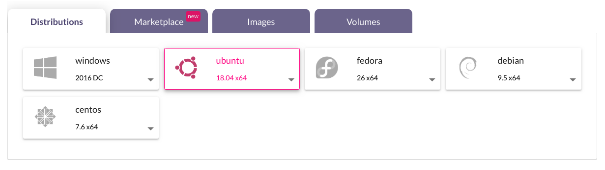



> _Image ที่มี Template สำเร็จรูป โดยเมื่อผู้ใช้งานสร้างด้วย Image ประเภทนี้ จะสามารถนำไปใช้งานได้เลย ไม่ต้องตั้งค่าใดๆเพิ่มเติม เช่น Docker, GitLab, Wordpress เป็นต้น_

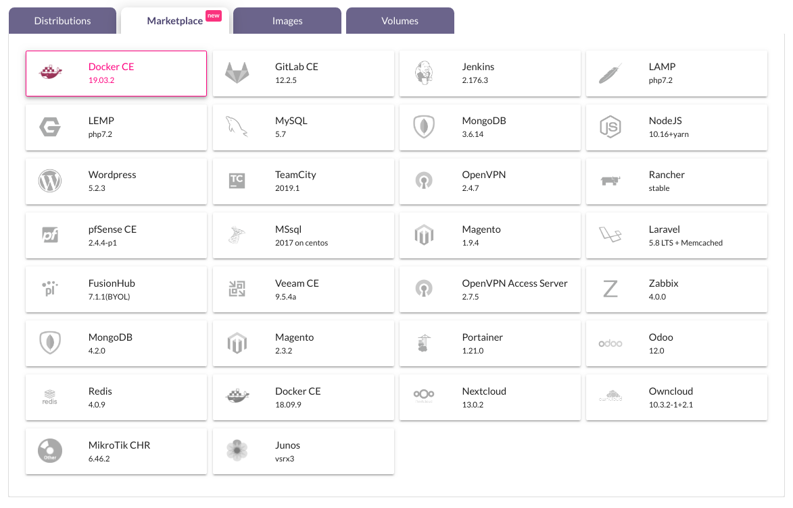



> _Image ที่เกิดจากการ Snapshot ของ Instance ด้วยผู้ใช้งานเอง หรือการทำ Auto Backup ของระบบ_




> _Image ที่เกิดจากการสร้าง Volume แบบ Boot Volume โดยในส่วนนี้ หากผู้ใช้งานต้องใช้ Feature นี้ จะต้อง Request ขอมายัง Administrator เพิ่มเปิดใช้งาน \(การสร้าง boot volume ดูได้จากหัวข้อ_ [_Create Volume_](https://github.com/Pippint/ncp-docs/tree/0794971fbf99dcd5e9275d595f5d258bdf7b2e35/storages/volume-management.md#create-volume)_\)_




### **Machine Type**

เลือก Machine Type โดย Machine Type จะแสดงตามการเลือกของ Image ซึ่งถูกแบ่งประเภทตามขนาดการใช้งาน ดังนี้



> _เป็น Spec สำหรับผู้ใช้งานบางประเภทที่ต้องการประหยัดค่าใช้จ่าย_




> _เป็น Spec การใช้งานมาตรฐานของผู้ใช้งาน_

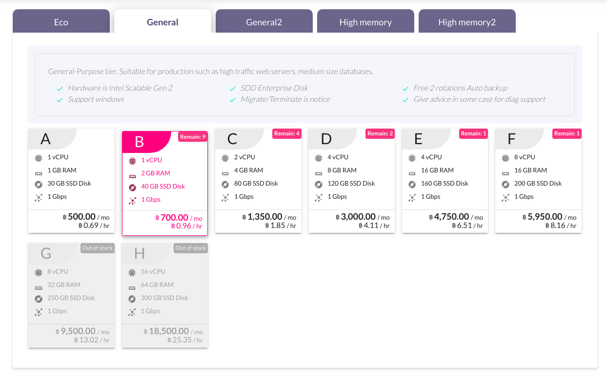



> _เป็น Spec ที่เหมาะกับผู้ใช้งานที่เน้นการใช้งาน Memory เป็นหลัก_

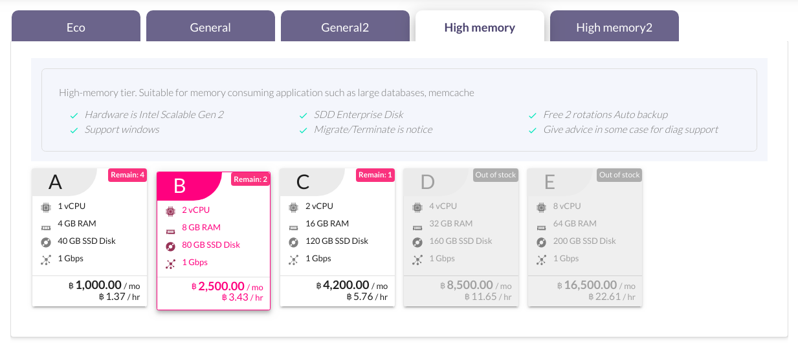



สำหรับผู้ใช้งานที่เลือกประเภท Image แบบ **Boot volume** ในส่วน Disk ของ Machine Type จะแสดงข้อความ **"Use existing volume"** ซึ่งหมายความว่า ขนาด Disk ของ Image ประเภทนี้จะขึ้นอยู่กับจำนวนของขนาด Volume Image ที่เลือก

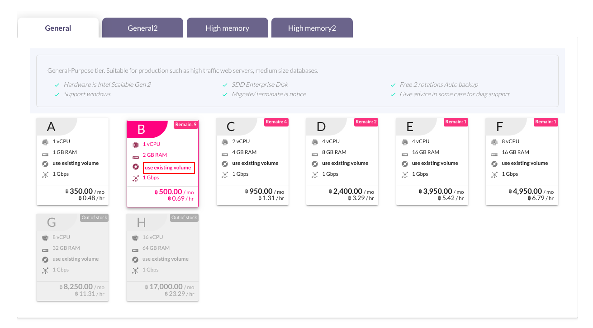

### **Cloud firewall**

### **Authentication**

เลือกประเภทการ Authentication ในการใช้งาน Instance ซึ่งจะแสดงตามการเลือกของ Image โดย Keypiar \(จะแสดงเมื่อเลือก Image ประเภท Linux\) และ Password \(จะแสดงเมื่อเลือก Image ประเภท Linux หรือ Windows\)

#### Keypair

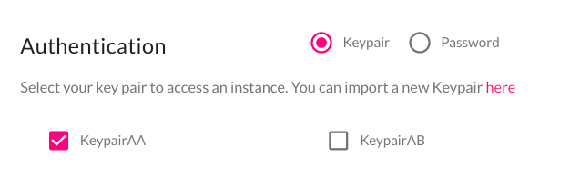

#### Password

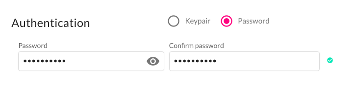


คลิก Network, Volume and more เพื่อดูหัวข้ออื่นๆ


### Number of instances

เลือกจำนวน Instance ที่ต้องการสร้าง โดยสามารถได้สูงสุดครั้งละ 5 Instance หากเหลือ Quota ในการสร้าง Instance เหลือน้อยกว่า 5 จะแสดงตามจำนวน Quota ที่เหลือ และสามาถสร้างได้เพียงครั้งละ 1 Instance เมื่อมีการเลือก/กำหนด Resource ดังนี้

* เลือก image ประเภท volume
* [Disable auto assign IP](launch-instance.md#network)
* [เลือก IP Address \(Port\) ที่ผู้ใช้งานสร้างขึ้นเอง](launch-instance.md#network)
* [เลือก External IP ที่ผู้ใช้งานสร้างขึ้นเอง](launch-instance.md#external-ip)

### **Instance Volume**

กำหนดขนาดของ **Disk** เมื่อสร้าง **Instance** แบบ **Boot volume** โดยจะสามารถกำหนดได้เมื่อเลือก Image ประเภท Distributions, Marketplace หรือ Images เท่านั้น หากเลือก Image ประเภท Volume จะใช้ขนาดตาม Volume ที่เลือก \(Optional\)

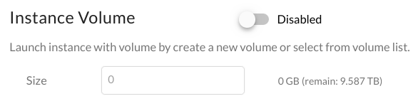

### **Network**

เลือก **Network** ที่ต้องการสร้าง Instance หากผู้ใช้งานเลือก Network แบบ Public จะไม่สามารถเลือก [External IP](launch-instance.md#external-ip) ได้ นอกจากกำหนด Network แล้วผู้ใช้งานสามารถกำหนด IP Address \(หมายเลข Port\) ของ instance หรือสร้าง Port \(ดูได้จากหัวข้อ Create Port\) ได้ด้วยตนเอง หากหมายเลขนั้นไม่มีผู้ใช้งานคนอื่นๆใช้งานอยู่ _**\(Optional\)**_

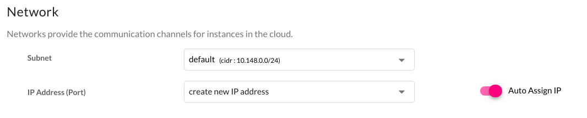

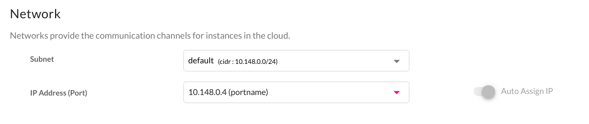

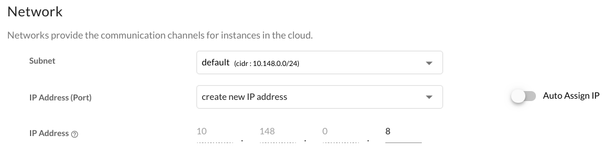

### **External IP**

* **Create a new IP:** ระบบจะทำการสุ่ม External IP ที่ไม่ถูกใช้งานให้  
* **Disabled:** Instance ที่ถูกสร้างจะไม่มีการใช้งาน External IP  
* เลือก External IP ที่ผู้ใช้งานสร้างเอง \(ดูได้จากหัวข้อ Create External IPs\)  
* Enable **Bypass Internal Network:** Instance ที่ถูกสร้างจะได้ internal IP เป็นเลข External IP แทน หาก Enable จะไม่สามารถเลือก [Network](launch-instance.md#network) ได้

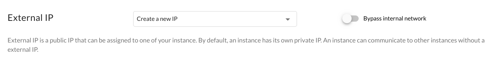

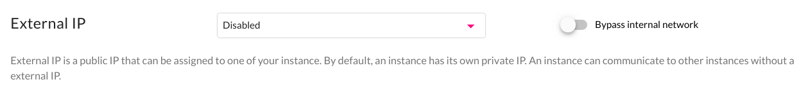

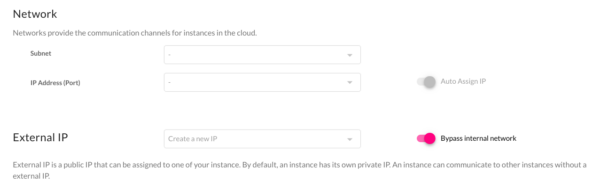

### **Auto Backup**

* **Enabled:** ระบบจะทำการ Backup Instance 2 files ทุกๆ 7 วัน ตอน 03:00 น. ให้อัตโนมัติ
* **Disabled:** ระบบจะไม่ทำการ Backup Instance ให้ ซึ่งผู้ใช้งานจะต้องทำการ Backup Instance ด้วยตนเอง โดยการ Snapshot

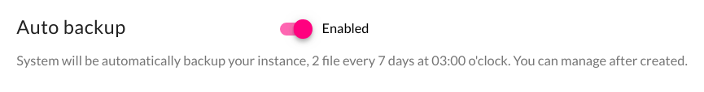


จากนั้นคลิกปุ่ม Create เพื่อสร้าง Instance โดยทางด้านซ้ายของปุ่ม จะแสดงราคาต่อเดือนตาม Resource ที่ผู้ใช้งานเลือก


## Using an Instance

### **Instance list**

เมื่อคลิกสร้าง Instance แล้ว ระบบจะแสดงหน้า Instance List หากสร้างสำเร็จจะแสดงผลลัพธ์ตามรูปด้านล่าง

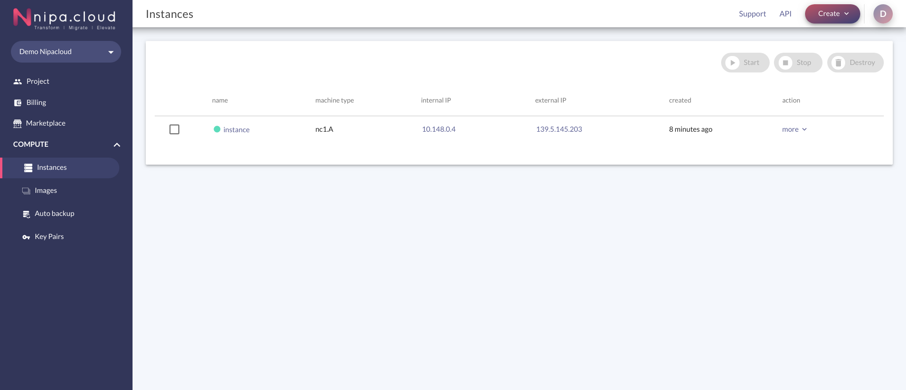

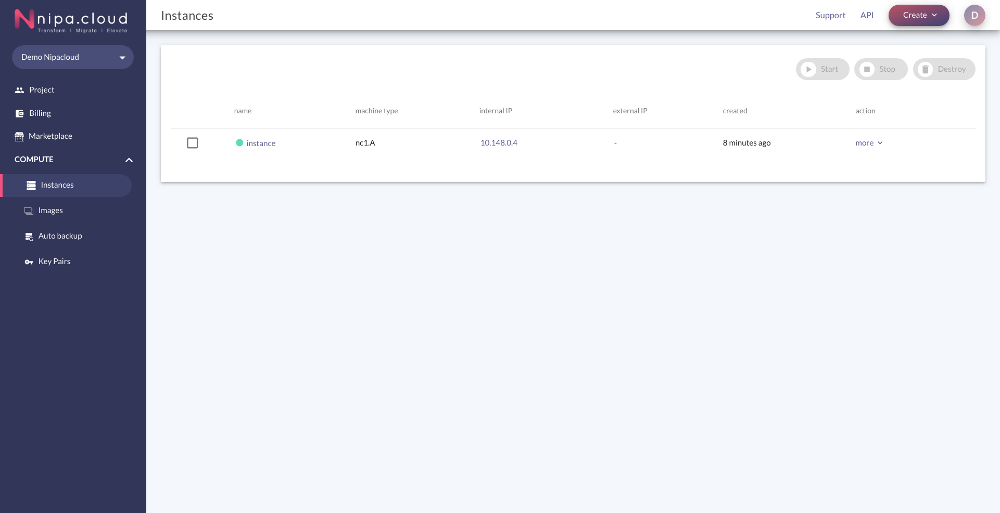

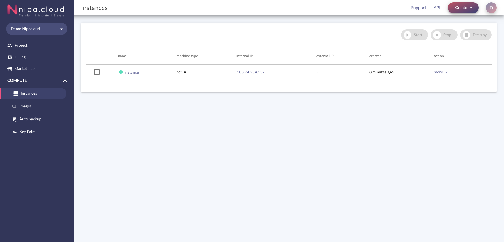

หากสร้าง Instance แบบ Boot Volume จะไม่สามารถดูผลลัพธ์ได้ในหน้า Instance list ผู้ใช้งานจะสามารถตรวจสอบได้ที่ Instance Detail โดยคลิกที่ชื่อ Instance

### Overview

โดยภายในหน้าของ Instance จะแสดงข้อมูลขนาด Disk ของ Instance เป็นประเภท Volume และมี 1 Volume หลังจากสร้าง Instance เรียบร้อยแล้ว

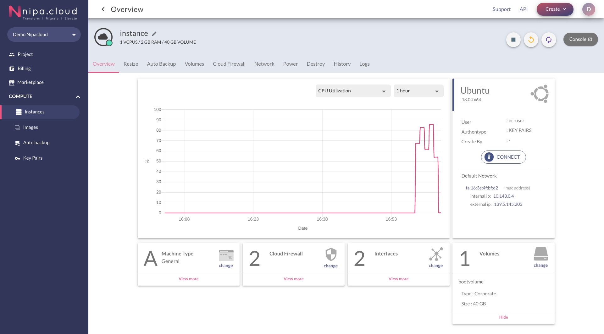

