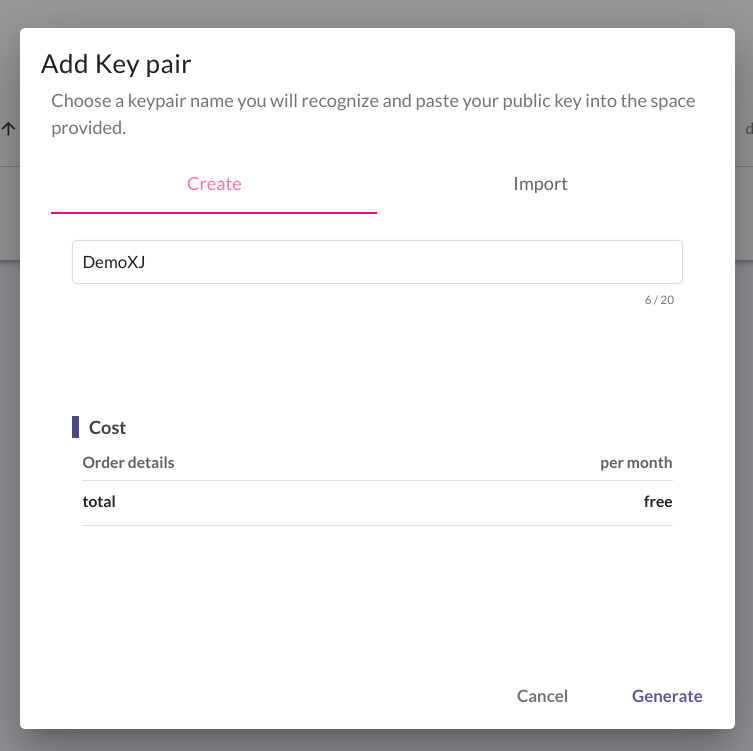
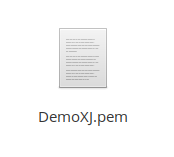
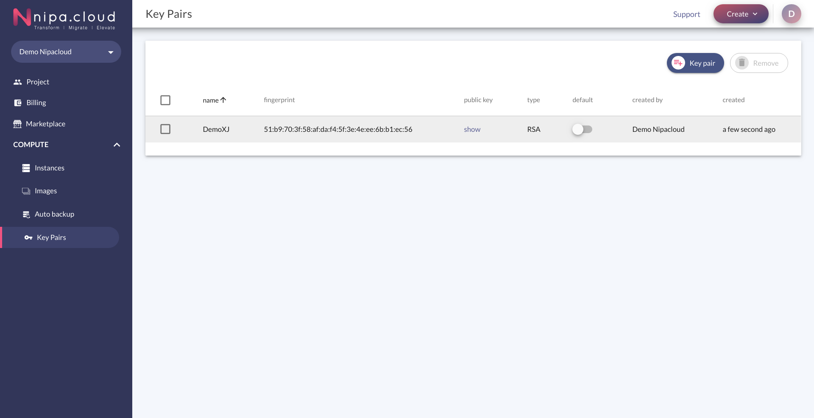
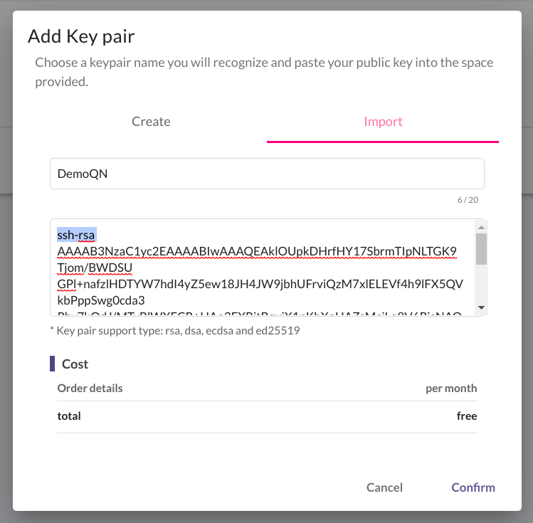
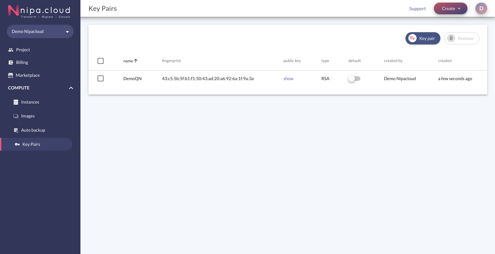
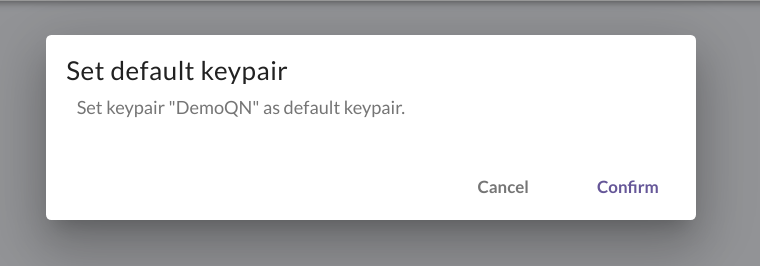
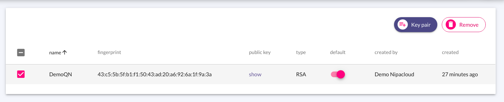
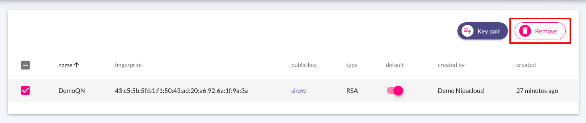
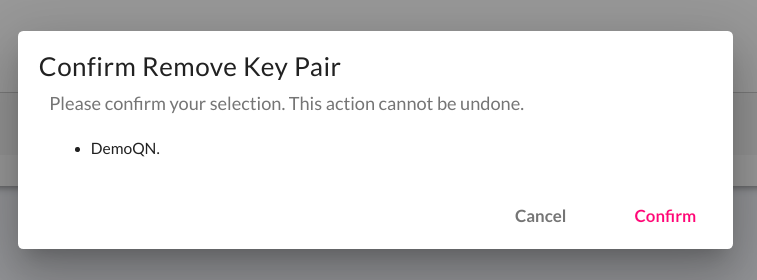
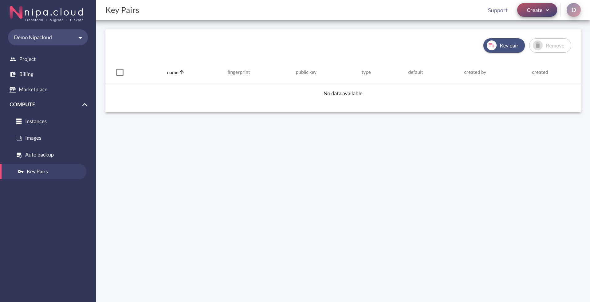

# Key pair management

ในส่วนของการเข้าถึง instance นั้น จำเป็นต้องมี Key หรือรหัสผ่าน เพื่อความปลอดภัยของข้อมูลภายใน Instance ของผู้ใช้งานเอง โดยผู้ใช้งานสามารถสร้าง Key ได้ด้วยตนเอง ซึ่ง Key ที่ได้จากการสร้าง เรียกว่า **Key pair** เมื่อสร้างแล้วผู้ใช้งานจะสามารถนำ Public Key ที่ได้ ไปใช้งาน โดยผู้ใช้งานสามารถจัดการกับ key pair ได้ ดังนี้

**Table of contents**

* [Create](key-pair-management.md#create)
  * [Generate Key](key-pair-management.md#generate-key)
  * [Import Key](key-pair-management.md#import-key)
* [Set Default](key-pair-management.md#set-default)
* [Remove](key-pair-management.md#remove)

## Create

### Generate key

เป็นการสร้าง โดยทางระบบจะ Generate Key ให้

1.คลิก Create Key Pair

2.หลังจากคลิกแล้ว หน้า Pop up จะแสดงขึ้นมา เลือกแทป Import ซึ่งจะประกอบด้วยข้อมูล ดังนี้

* **Name**: ระบบจะทำการสุ่มชื่อ Key Pair ให้ เป็น Default ผู้ใช้งานสามารถแก้ไขได้

3.คลิก Generate ระบบจะ Download Key Pair file \(.pem\) ที่ Generate มาให้ผู้ใช้งานสามารถนำ Public Key ไปใช้งานได้ โดยชื่อไฟล์จะเป็นชื่อตามที่ผู้ใช้งานกรอกตอน Create และจะแสดงรายชื่อ Key Pair ภายใน Table


ผู้ใช้งานสามารถ คลิก Show ในตารางส่วนของ Column Public Key เพื่อ Copy Public Key ไปใช้งาน Instance ได้


### Import key

ผู้ใช้งานสามารถ Import Key ของตนเองได้ โดยทางระบบจะรองรับ key ประเภท **rsa**, **dsa**, **ecdsa** และ **ed25519**

1.คลิก Create Key Pair

2.หลังจากคลิกแล้ว หน้า popup จะแสดงขึ้นมา เลือก tab "Import" ซึ่งจะประกอบด้วยข้อมูล ดังนี้

* **Name**: ระบบจะทำการ random ชื่อ key pair ให้ เป็น default ผู้ใช้งานสามารถแก้ไขได้  
* **Public key**: ส่วนที่ให้ผู้ใช้งานกรอก key ของตนเอง โดยระบบจะรองรับ key โดยทางระบบจะรองรับ key ประเภท **rsa**, **dsa**, **ecdsa** และ **ed25519**

3.คลิก Confirm ระบบจะทำการสร้าง key Pair ตามที่ผู้ใช้งานกรอก และแสดงรายชื่อ Key Pair ภายใน Table


ผู้ใช้งานสามารถ คลิก Show ในตารางส่วนของ Column Public Key เพื่อ Copy Public Key ไปใช้งาน Instance ได้


## Set default

การ Set Default Key Pair คือ การตั้งค่าในการเลือก Default Key Pair ในขณะที่สร้าง Instance ผู้ใช้งานสามารถจัดการได้ด้วยตนเอง เมื่อสร้าง Key Pair เรียบร้อยแล้ว เริ่มต้น Status จะเป็น Disable

1.คลิก Enable หรือ Disable \(ขึ้นอยู่กับ Status ขณะนั้น\) ในส่วนของ Column Default Key Pair

2.หลังจากคลิกแล้ว หน้า Pop-up จะแสดงขึ้นมา ให้คลิก Confirm

3.ระบบจะแสดง Status ตามที่ผู้ใช้งานตั้งค่า

## Remove

1.เลือก key Pair ที่ต้องการลบ \(ผู้ใช้งานสามารถลบหลาย Key Pair พร้อมกันได้\)

2.คลิกปุ่ม Remove

3.หลังจากคลิกแล้ว หน้า Pop-up จะแสดงขึ้นมา และแสดงรายชื่อ Key Pair ที่ต้องการลบ ให้คลิก Confirm

4.Key Pair ที่เลือกจะถูกลบไป ซึ่งจะไม่ปรากฏในตาราง

