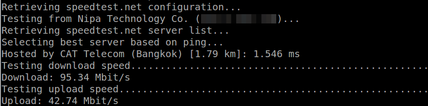

# วิธีทดสอบความเร็วอินเตอร์เน็ตของ INSTANCE

## วิธีทดสอบความเร็วอินเตอร์เน็ตของ INSTANCE

1.connect เข้าสู่ Instance ด้วยคำสั่ง

```text
ssh nc-user@<external IP>
```

2.ติดตั้ง wget เพื่อ download โปรแกรมทดสอบความเร็ว โดยใช้คำสั่ง

* สำหรับ Ubuntu และ Debian

  ```text
  $ sudo apt-get update
  $ sudo apt-get install wget
  ```

* สำหรับ Centos และ Fedora

  ```text
  $ sudo yum update
  $ sudo yum install wget
  ```

3.ติดตั้ง tool สำหรับทดสอบความอินเตอร์เน็ต

```text
$ wget -O speedtest-cli https://raw.githubusercontent.com/sivel/speedtest-cli/master/speedtest.py

$ chmod +x speedtest-cli
```

4.run โปรแกรมเพื่อทดสอบความเร็วโดยใช้คำสั่ง

```text
$ ./speedtest-cli
```

5.โดยผลลัพธ์ที่ได้จะประกอบด้วยความเร็วในการ Download และ Upload ดังภาพ 

