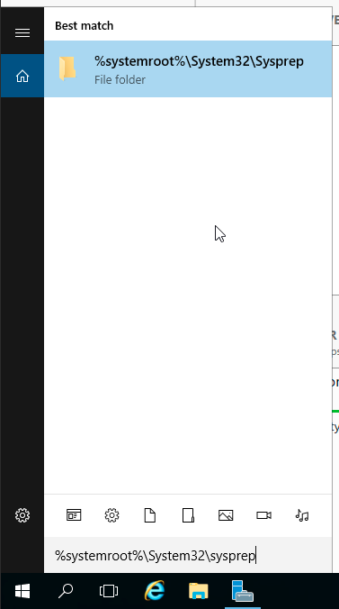
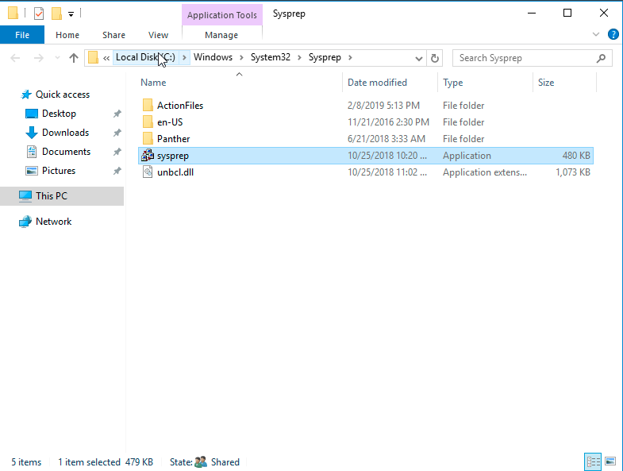
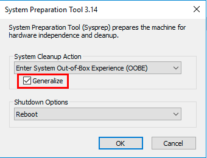
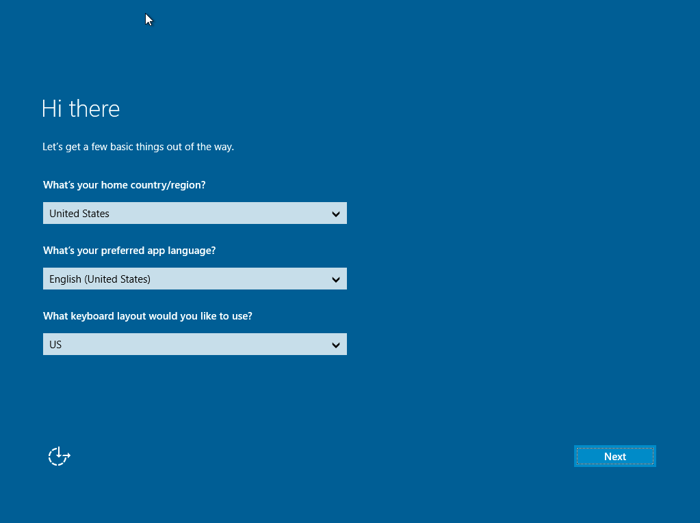
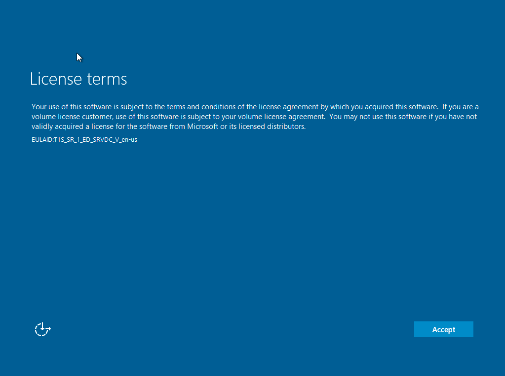
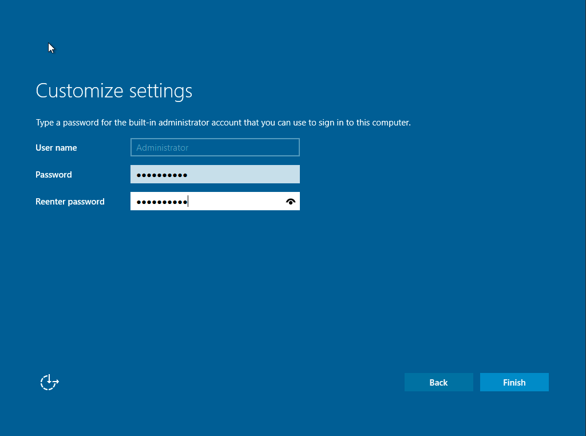
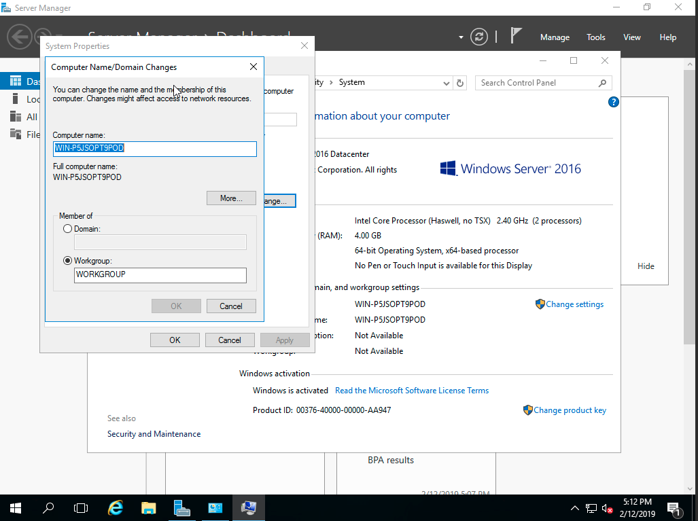

# HOW TO RESET SID OF WINDOWS SERVER

## HOW TO RESET SID OF WINDOWS SERVER

เนื่องจากเครื่องบน cloud ถูกสร้างจาก image ตัวเดียวกันเสมอ จึงทำให้เกิด SID ที่ตรงกัน  
ผลกระทบจากกรณีดังกล่าวคือ ทำให้ไม่สามารถ join Domain ได้ เนื่องจาก SID ตรงกัน

สามารถทำการ reset SID ได้ดังนี้

1.Login ด้วย user ที่มีสิทธิ์ Administrator

2.เข้าไปยัง path `%systemroot%\Windows32\sysprep` 

3.เปิดโปรแกรมชื่อ sysprep.exe 

4.ตรวจสอบค่าให้เป็นดังนี้ แล้วกดปุ่ม OK 

5.โปรแกรมจะทำการ Reboot Instance และ reset SID ของเครื่อง รวมถึงค่า config อื่นๆ  
เช่น Keyboard & Language Setting, Administrator Password และ Hostname เครื่อง

6.หลังจาก Reboot เสร็จ จะขึ้นหน้าจอดังนี้ 

7.ให้ทำการ set ค่า ดังนี้ แล้วกดปุ่ม Next

```text
region: Thailand
app language: English (United States)
keyboard layout: US
```

8.กดปุ่ม Accept License 

9.กำหนด password สำหรับ user Administrator แล้วกดปุ่ม Finish 

10.หลังจากนั้นให้ทำการ Login แล้วไปแก้ Computer name เครื่อง

11.ไปที่ Control Panel &gt; System and Security &gt; System  
หัวข้อ Computer name เลือก Change Settings  
Tab Computer Name กดปุ่ม Change  
แก้ไข Computer name ให้ถูกต้องแล้วกดปุ่ม OK  


