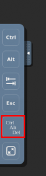
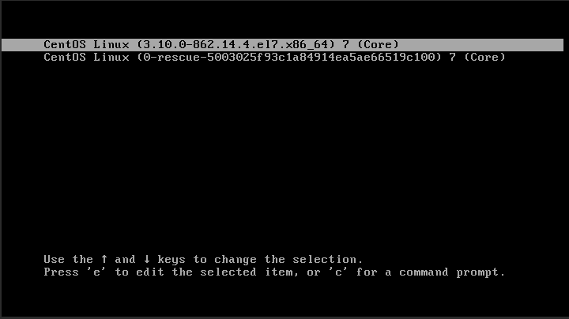
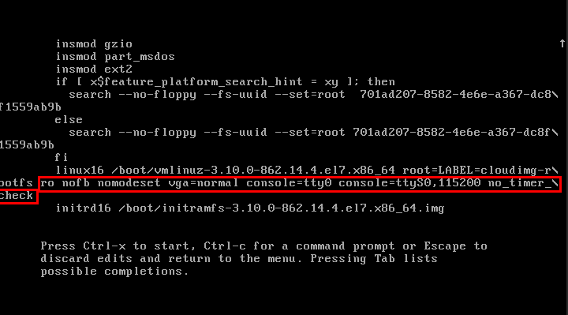
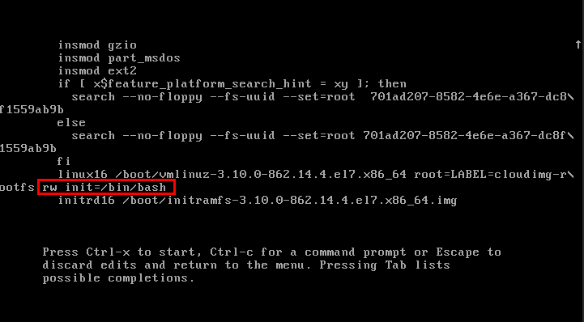
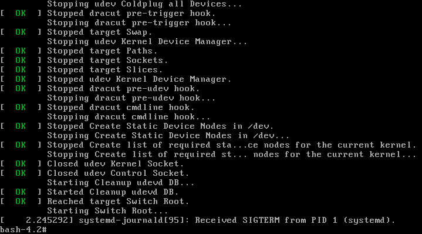
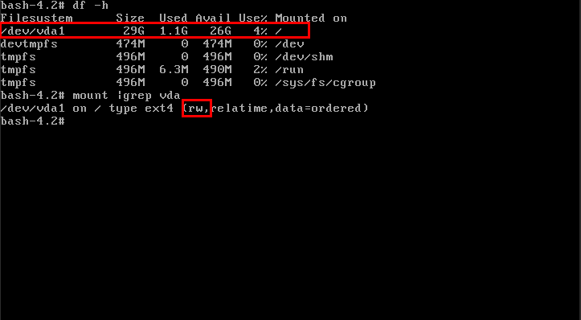
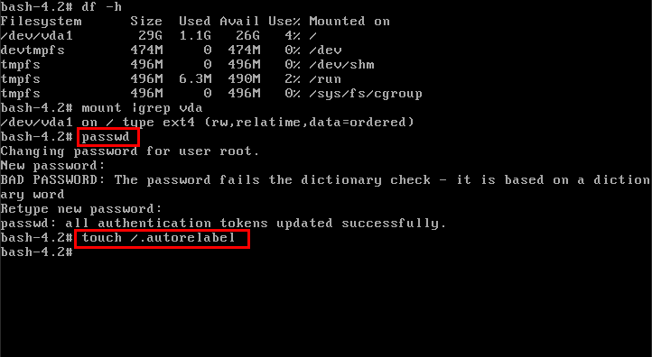
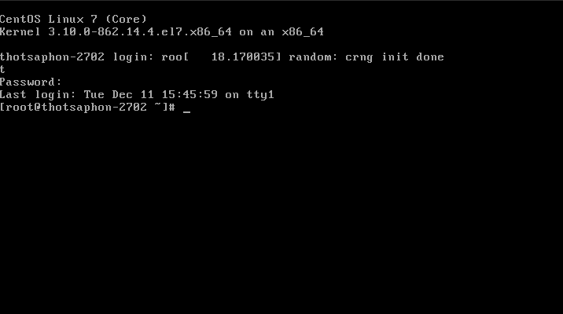

# Knowledge

## วิธีการ RESET ROOT PASSWORD บน CENTOS7

> Note: ควรทำการ snapshot ก่อนการแก้ไข เนื่องจากหากมีการแก้ไขผิดพลาดจากขั้นตอนที่ระบุไว้ตามเอกสาร อาจทำให้ระบบพังและไม่สามารถ boot ได้อีก

1.Access เข้า Console ของเครื่อง และ reboot เครื่องด้วย Ctrl-Alt-Del   


2.เมื่อเครื่อง reboot ขึ้นมา ให้กด e เพื่อ edit (บรรทัดที่ไม่ใช่ rescue)   


3.แก้ไข บรรทัด Linux16 แก้ไขให้เป็น   
```rw init=/bin/bash```   
จากเดิม   

แก้ไขเป็น


4.กด Ctrl-x เพื่อ boot จาก config ที่แก้ไข เมื่อ boot เสร็จจะเข้า single user mode ดังภาพ


5.ตรวจสอบว่า vda ถูก mount บน / และมีสถานะเป็น rw


6.ใช้ command passwd เพื่อ set password ให้กับ user root   
และ touch /.autorelabel เพื่อให้เกิดการ relabel ของ SELinux เมื่อ boot


7.reboot ด้วย command ดังนี้   
```exec /sbin/init```


8.ทดสอบ login ด้วย password ใหม่
