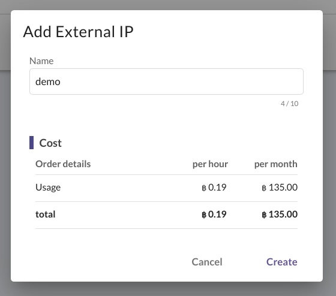

# External IP management

ในการที่ Instance, Load Balancer หรือ Port ต่างๆ จะเชื่อมต่อกับ network ภายนอกได้นั้น ผู้ใช้งานจำเป็นที่จะต้องมี External IP ผูกติดกับ Instance, Load Balancer หรือ Port อยู่ เพื่อเป็นช่องทางในการเชื่อมต่อ โดยผู้ใช้งานสามารถจัดการ External IP ต่างๆ ได้ ดังนี้

**Table of contents**

* [Create](external-ip-management.md#create-external-ip)
* Link / Unlink
* [Remove](../authentications/key-pair-management.md#remove)

## Create External IP

1.คลิก Create External IP

2.หลังจากคลิกแล้ว หน้า Pop up จะแสดงขึ้นมา ให้กรอกชื่อ External IP ที่ต้องการ แล้วคลิก Confirm


ในการคิดราคา External IP ทางระบบจะคิดราคา เมื่อผู้ใช้งานไม่มีการผูกติดระหว่าง External IP กับ Instance, Load Balancer หรือ Port ต่างๆ


3.หลังจากคลิก Confirm แล้ว จะเห็นรายชื่อ External IPs ที่ทำการสร้างในตาราง

