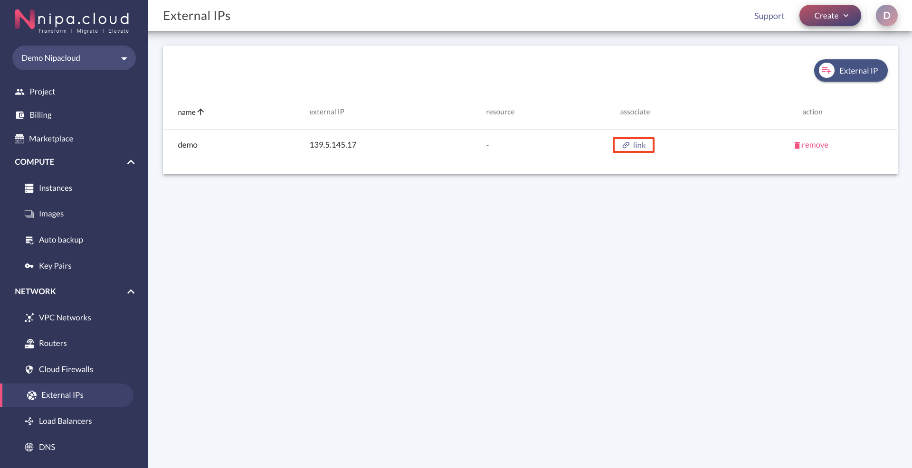
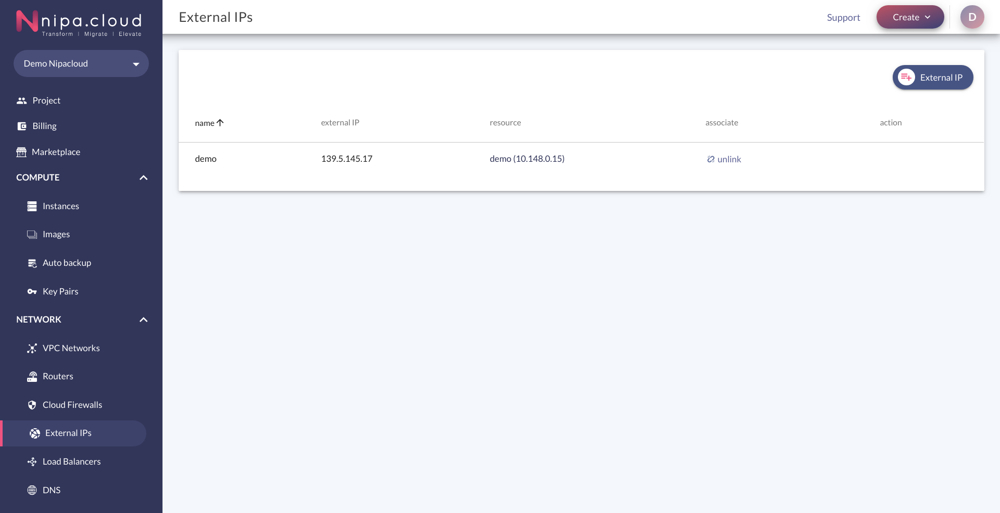
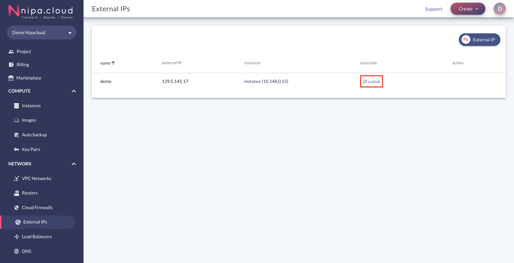
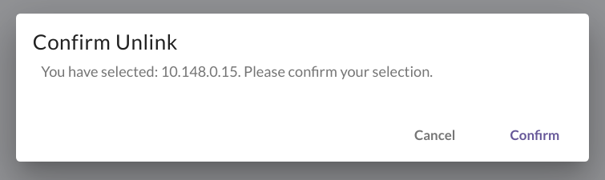

# External IP management

ในการที่ Instance, Load Balancer หรือ Port ต่างๆ จะเชื่อมต่อกับ network ภายนอกได้นั้น ผู้ใช้งานจำเป็นที่จะต้องมี External IP ผูกติดกับ Instance, Load Balancer หรือ Port อยู่ เพื่อเป็นช่องทางในการเชื่อมต่อ โดยผู้ใช้งานสามารถจัดการ External IP ต่างๆ ได้ ดังนี้

**Table of contents**

* [Create](external-ip-management.md#create-external-ip)
* [Associate](external-ip-management.md#associate)
  * [Link](external-ip-management.md#link-external-ips)
  * [Unlink](external-ip-management.md#unlink-external-ip)
* Remove

## Create External IP

1.คลิก Create External IP

2.หลังจากคลิกแล้ว หน้า Pop up จะแสดงขึ้นมา ให้กรอกชื่อ External IP ที่ต้องการ แล้วคลิก Confirm


ทางระบบจะคิดค่าบริการ External IP เมื่อผู้ใช้งานไม่มีการผูกติดกันระหว่าง External IP กับ Instance, Load Balancer หรือ Port ต่างๆ


3.หลังจากคลิก Confirm แล้ว จะเห็นรายชื่อ External IPs ที่ทำการสร้างในตาราง

## Associate

### Link External IPs

Link External IP คือ การที่ผู้ใช้งานทำการผูกติด External IP กับ Instance, Load Balancer หรือ Port ต่างๆ จะเชื่อมต่อกับ network ภายนอกได้ โดยมีขั้นตอนการทำงาน ดังนี้

1.คลิกปุ่ม link

2.หลังจากคลิกแล้ว หน้า Pop up จะแสดงขึ้นมา ให้เลือก Port ที่ต้องการ Link แล้วคลิก Confirm

3.เมื่อ Link เรียบร้อยแล้ว ภายในตาราง จะแสดงชื่อ Port พร้อมเลข IP Address ของ Port ที่ Column "resource"

### Unlink External IPs

Unlink External IP คือ การที่ผู้ใช้งานทำการถอด External IP ที่ผูกติดอยู่กับ Instance, Load Balancer หรือ Port ต่างๆ ออก ซึ่งจะทำให้ไม่สามารถเชื่อมต่อกับ Network ภายนอกได้ โดยมีขั้นตอนการทำงาน ดังนี้

1.คลิกปุ่ม unlink

2.หลังจากคลิกแล้ว หน้า Pop up จะแสดงขึ้นมา คลิก Confirm

3.เมื่อ Confirm เรียบร้อยแล้ว ระบบจะถอด Port ที่ผูกติดอยู่กับ External IP ออก โดยภายในตารางจะไม่แสดงรายชื่อ Port ที่ Column "resource"

