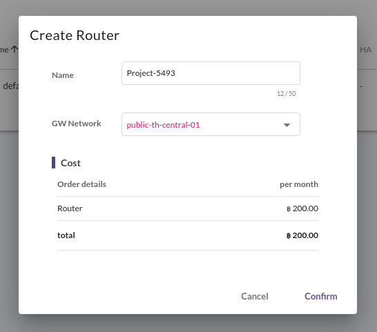
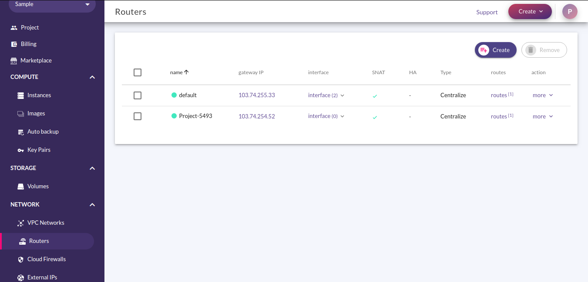
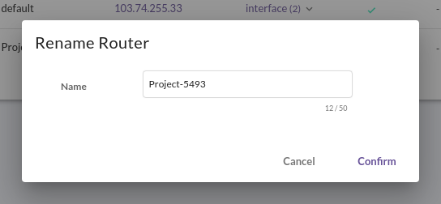
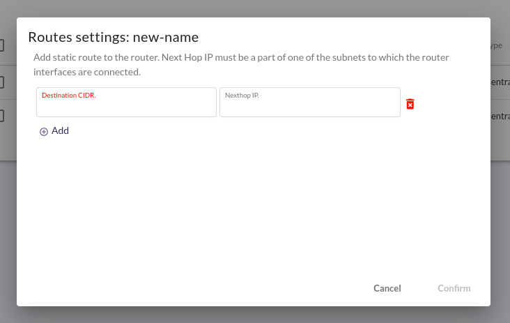
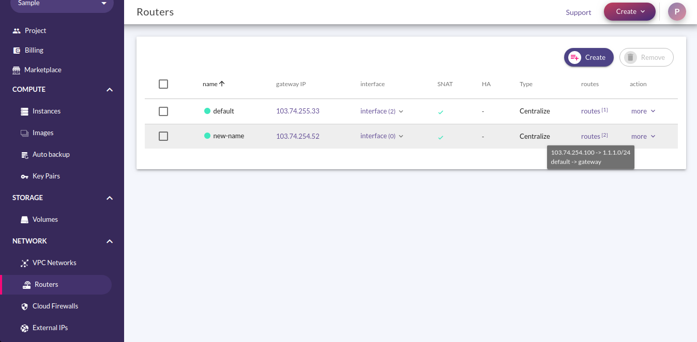
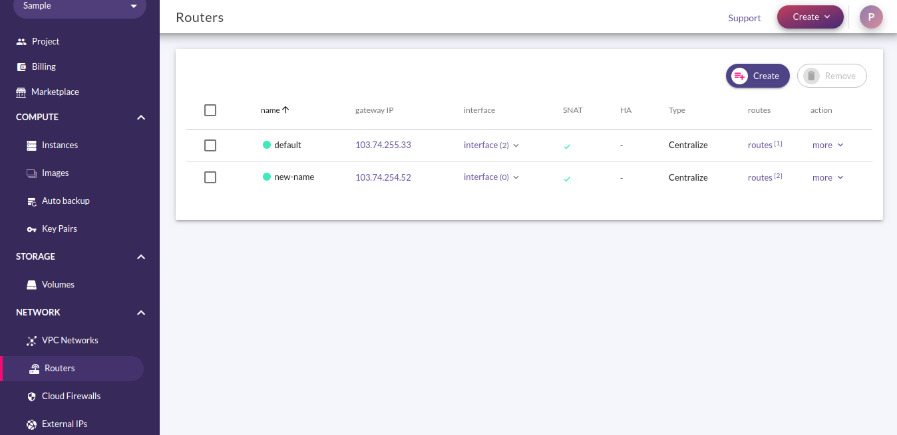
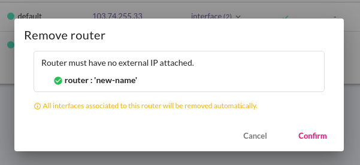
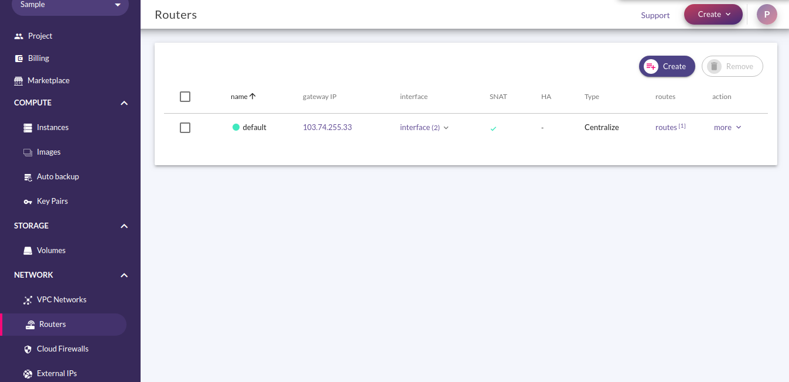

# Routers Management

Router เป็นอีกหนึ่ง Resource ที่สำคัญสำหรับการใช้งาน Cloud ที่จะทำให้ Instance สามารถติดต่อสื่อสารกันได้ รวมถึงติดต่อสื่อสารกับโลกภายนอกได้อีกด้วย โดย Feature นี้จะถูกเปิดให้ใช้งานเฉพาะบาง Project เท่านั้น ใน Project ที่ไม่ได้เปิดให้ใช้งาน จะมี Default Router ให้ใช้งานอยู่แล้ว

## Create  a Router

การสร้าง Router ขึ้นมาเพิ่มเติมจาก Default Router มีขั้นตอนดังนี้

1.เมื่อ Login เข้ามาใน NCP ให้คลิกที่ Routers ภายใต้กลุ่ม Network ที่ Sidebar เพื่อเข้าสู่ Routers Page

2.กดที่ปุ่ม Create ที่บริเวณด้านขวาบนของ Page เพื่อเข้าสู่ Create Router Page

3.ที่หน้า Create Router Page ให้ใส่ข้อมูลดังต่อไปนี้

* Name: ใส่ชื่อของ Router ใหม่
* GW Network: เลือก Network ที่ใช้เป็น Gateway สู่โลกภายนอก

ตรวจสอบข้อมูลให้ถูกต้องแล้วกดปุ่ม Confirm เพื่อสร้าง Router ระบบจะพากลับไปที่ Routers Page พร้อมแสดง Router ที่ถูกสร้าง

## Rename

Router สามารถเปลี่ยนชื่อได้ โดยมีขั้นตอนดังนี้

1.เมื่อ Login เข้ามาใน NCP ให้คลิกที่ Routers ภายใต้กลุ่ม Network ที่ Sidebar เพื่อเข้าสู่ Routers Page

2.กดที่ปุ่ม more ที่ Router ที่ต้องการเปลี่ยนชื่อ

3.กดที่ปุ่ม Rename เพื่อเข้าสู่ Rename Router Page

4.ใส่ชื่อใหม่ที่ต้องการที่ช่อง Name แล้วกด Confirm เพื่อ Rename Router นี้ ระบบจะพากลับไปที่ Routers Page พร้อมแสดง Router ที่ถูกเปลี่ยนชื่อ

## Setting a Router

Router สามารถปรับแต่งเพิ่มเติม Static Route ได้ โดยมีขั้นตอนดังนี้

1.เมื่อ Login เข้ามาใน NCP ให้คลิกที่ Routers ภายใต้กลุ่ม Network ที่ Sidebar เพื่อเข้าสู่ Routers Page

2.กดที่ปุ่ม more ที่ Router ที่ต้องการเพิ่ม Static Route

3.กดที่ปุ่ม Rename เพื่อเข้าสู่ Routes Setting Page

4.ใส่ข้อมูล Static Route ที่ต้องการ โดยประกอบไปด้วย

* Destination CIDR: CIDR ของวง Network ปลายทาง
* Nexthop IP: IP ที่จะใช้เป็น Nexthop ไปสู่ Network ปลายทาง

แล้วกด Confirm เพื่อเพิ่ม Static Route ลงบน Router นี้ ระบบจะพากลับไปที่ Routers Page

## Remove Router

Router ที่สร้างขึ้นมาเอง สามารถลบทิ้งได้โดยมีขั้นตอนดังนี้

1.เมื่อ Login เข้ามาใน NCP ให้คลิกที่ Routers ภายใต้กลุ่ม Network ที่ Sidebar เพื่อเข้าสู่ Routers Page

2.คลิกที่ Box หน้า Router ที่ต้องการลบ แล้วกดที่ปุ่ม Remove ด้านขวาบนของ Page เพื่อเข้าหน้า Remove Router Page


Router ที่จะลบ จะต้องไม่มี External IP Attach อยู่


3.กดที่ปุ่ม Confirm เพื่อลบ Router ระบบจะพากลับไปที่ Routers Page แสดงให้เห็น Router ที่เหลืออยู่

