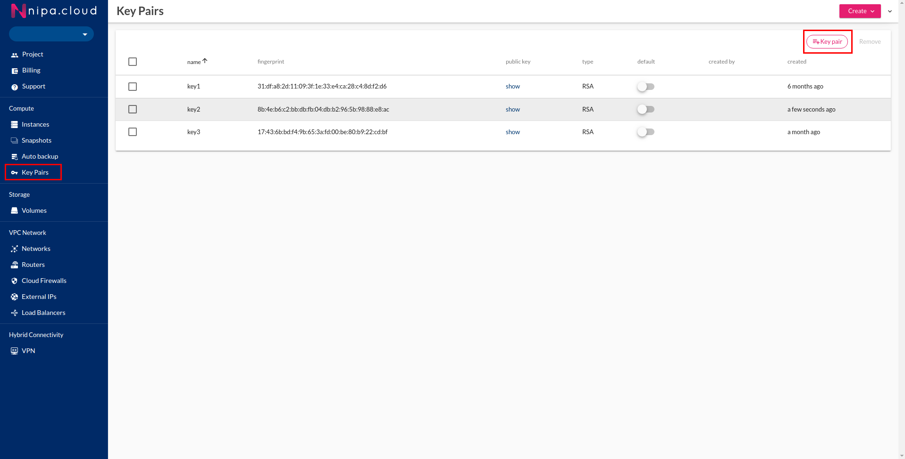

# Change SSH Key

วิธีการเปลี่ยน SSH key ที่ใช้ในการ Login โดยที่ SSH key เดิมยังใช้งานได้


Use case สำหรับต้องการเปลี่ยน SSH Key เนื่องจาก เปลี่ยนผู้ดูแลระบบ Key File เดิมยังสามารถใช้งาน Login เข้าระบบได้ ไม่ต้องการทำ Snapshot และ Restore ใหม่


1.Generate ssh key file ใหม่ ด้วย command **ssh-keygen** หรือ ทำการสร้าง key ใหม่จากหน้า NIPA Cloud Portal หมวด **Key-pair**



หากใช้การสร้าง Key จาก ssh-keygen ควรนำ Public Key ที่ได้มา Import เข้าระบบด้วย เพื่อใช้ในกับเครื่องที่จะสร้างใหม่หลังจากนี้

2.หากทำการสร้าง Key-pair จากหน้า Portal จะต้องทำการ Extract Public Key ออกมาจาก Private Key ที่ได้ ด้วย Command ดังนี้

```bash
ssh-keygen -y -f newkey.pem > /tmp/newkey.pub
```

3.ทำการ Replace **authorized\_keys** ด้วย command ดังนี้

```bash
cat newkey.pub | \
ssh -i oldkey.pem nc-user@<server ip address> \
"cat > ~/.ssh/authorized_keys"
```

4.ทดสอบ ssh ด้วย key ใหม่

```bash
ssh -i newkey.pub nc-user@<server ip address>
```

