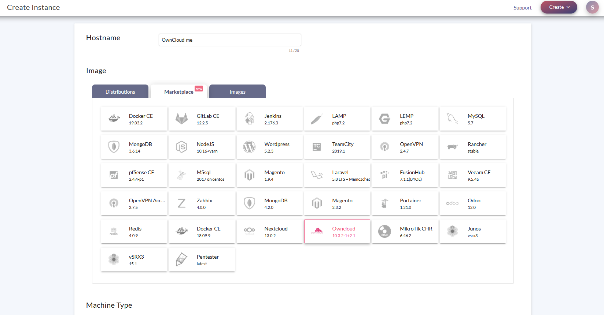
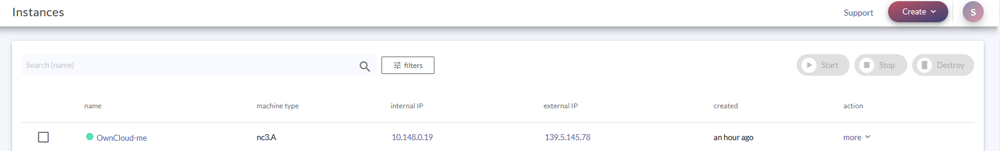
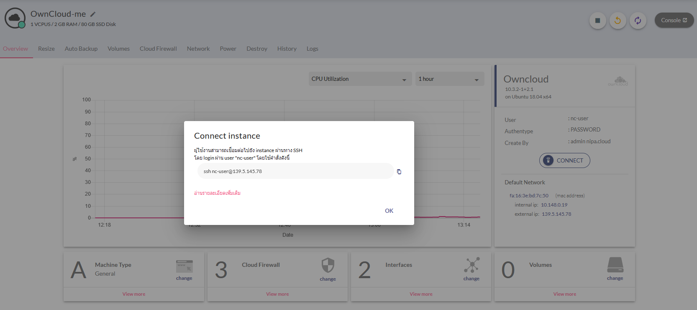
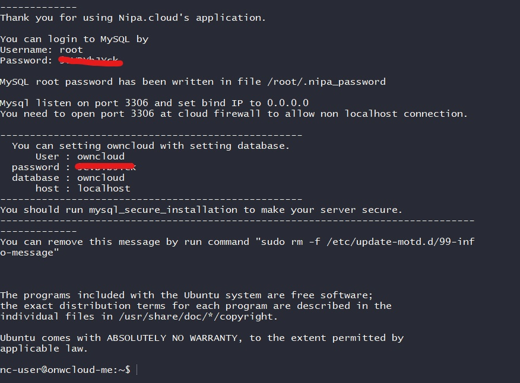
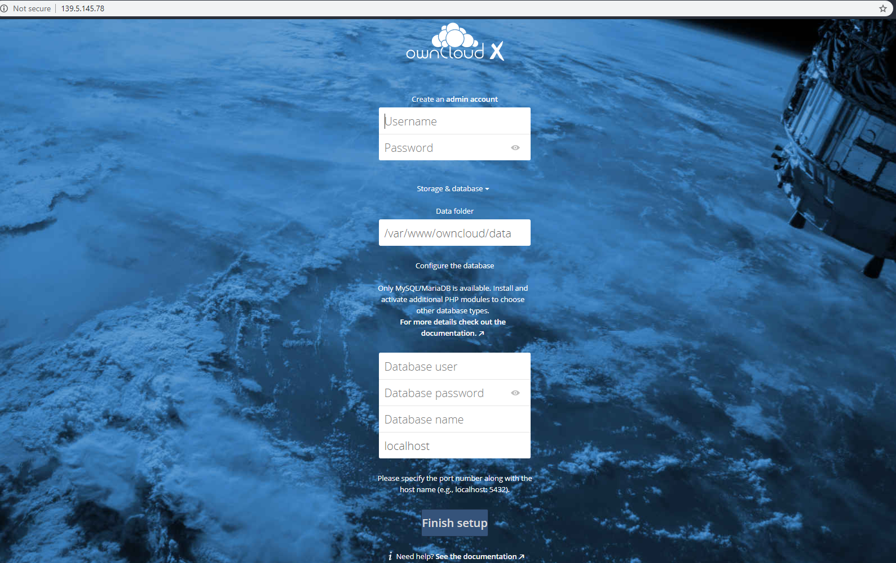
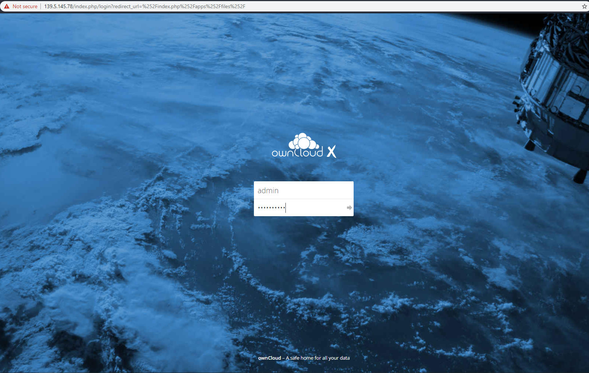
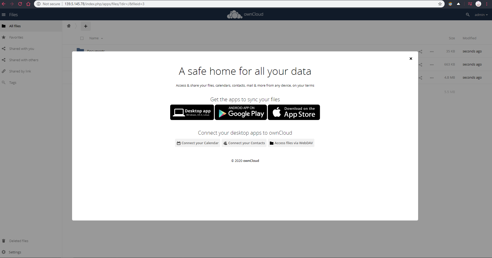

# Create OwnCloud

**How to Create OwnCloud**

1.สร้าง Instant ใน NipaCloud เลือกหัวข้อ Marketplace &gt;&gt; OwnCloud

2.เลือกขนาดของเครื่อง Server ที่เราใช้โดยที่ OwnCloud Recommend 512MB Memory.

3.หลังจากนั้นเราจะได้ Instant มาให้เรากดเข้าที่ชื่อของ Instant ที่เราสร้างมา

4.ให้เรากด CONNECT และ Copy SSH เพื่อเข้าไปเอา Pass และ Name ของ Database Owncloud

5.หลังจากเรา SSH เข้ามาเราจะเห็น User, Password, Database ของเรา

6.เมื่อเราได้ User, Password, Database มาแล้วให้นำไปกรอกใน เว็ป OwnCloud หรือ External IP ของ Instant ที่ เราสร้างไว้ โดย Username, Password ด้านบนคือ ID ของOwnCloud ของเรานะครับ

7.หลังจากที่เรากรอกเสร็จ หน้าเว็ปของเราจะเปลี่ยน ให้เราใส่ Username, Password ที่เราสร้าง

8.เราก็จะได้ OwnCloud ของเราเรียบร้อยแล้ววว

