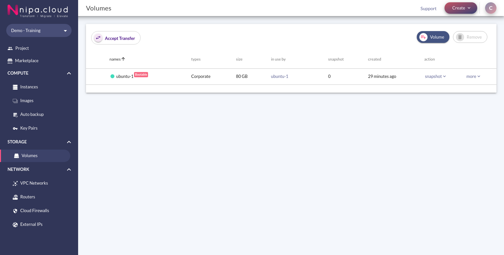
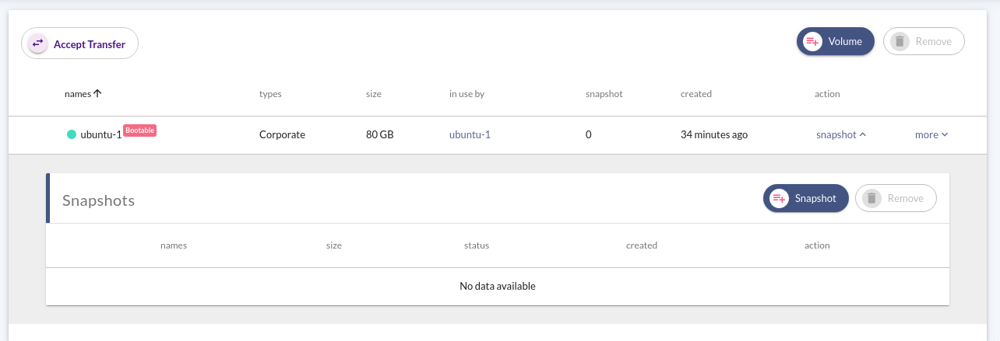
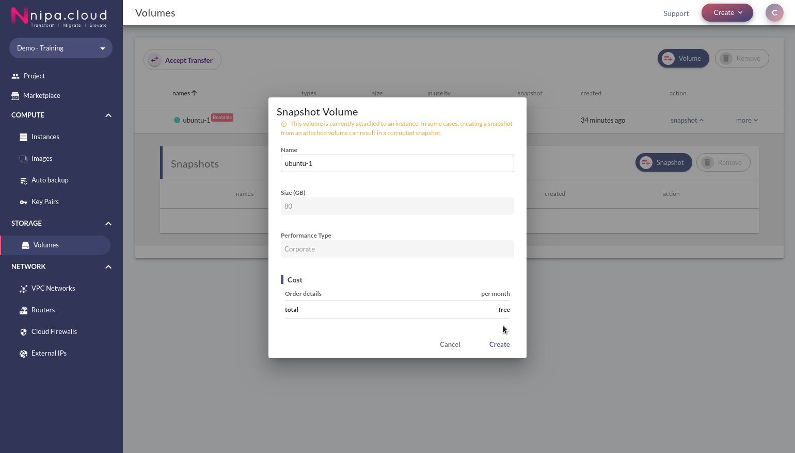
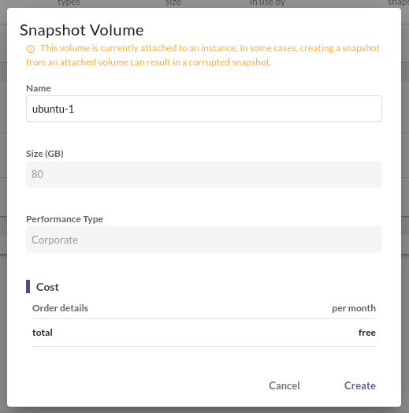
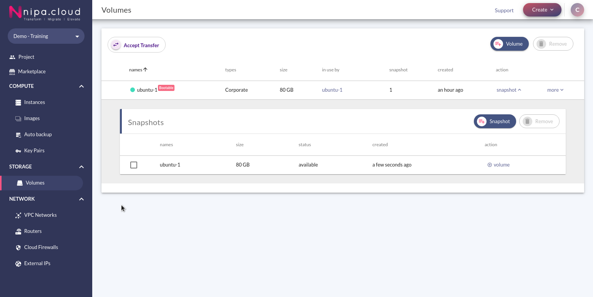
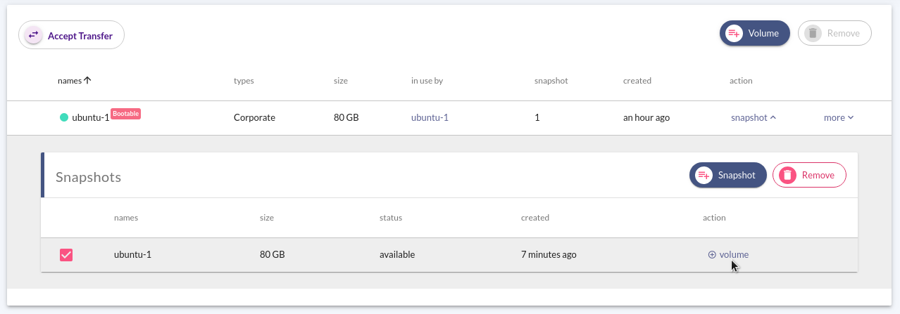
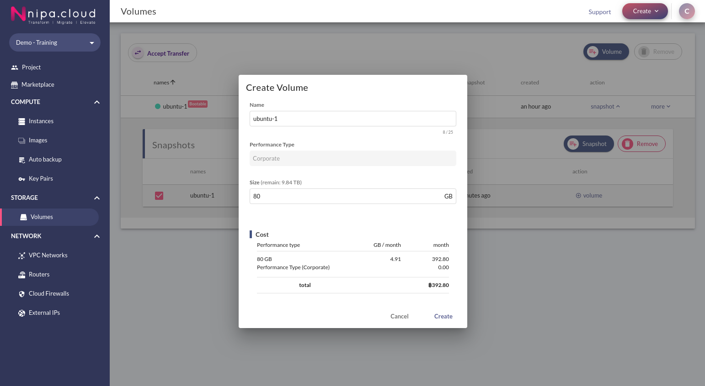
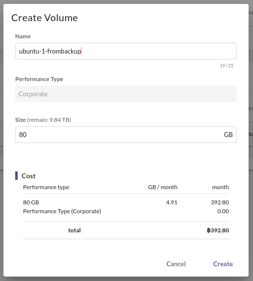
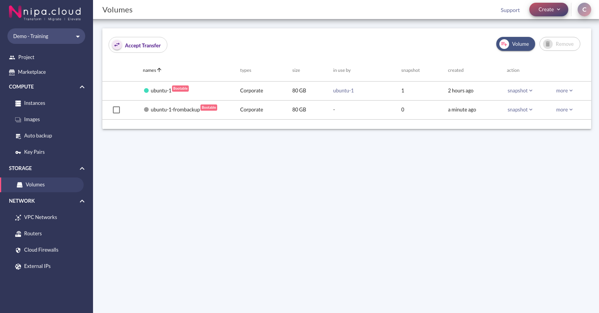

# Volume Snapshot

Volume Snapshot เป็นการทำ Snapshot ของข้อมูลใน Volume ต้นฉบับขณะนั้น เพื่อนำไปเก็บเป็น Backup หรือนำมาใช้ในการกู้คืนข้อมูลภายหลัง

Volume Snapshot สามารถสร้างได้จากทั้ง Volume ธรรมดาและ Bootable Volume

## สร้าง Volume Snapshot

1. เมื่อเข้าสู่ระบบ NCP ไปที่เมนู Volumes ภายใต้กลุ่ม Storage ที่ Sidebar ระบบจะแสดงรายการ Volume ทั้งหมดของ Project

หากไม่มีรายการ Volume ปรากฎ คุณอาจยังไม่มี Volume ในระบบ โปรดดู[การสร้าง Volume](volumes-management.md#create-volume)

1. ที่รายการของ Volume คลิก Action Snapshot ของ Volume ที่ต้องการเพื่อแสดงรายการของ Snapshot

คลิกปุ่ม Snapshot บนรายการ Snapshot ด้านขวาบนเพื่อแสดงกล่องโต้ตอบ Snapshot Volume

1. คุณสามารถเลือกตั้งค่าชื่อให้กับ Volume Snapshot ตามต้องการได้ ขนาดของ Volume Snapshot และ Performance Type จะถูกตั้งค่าให้ตรงกับ Volume ต้นฉบับ   

โดยราคาของ Volume Snapshot จะถูกแสดงด้านล่างของกล่องโต้ตอบ

เมื่อตั้งค่าเรียบร้อย เลือกปุ่ม Create เพื่อทำการสร้าง Snapshot Volume

1. เมื่อ Snapshot ถูกสร้างจะปรากฎในรายการของ Snapshots ภายใต้ Volume ที่เลือกไว้

## สร้าง Volume ใหม่จาก Volume Snapshot

1. จากรายการ Snapshots เลือก Action "+ Volume" ของ Snapshot ที่ต้องการ

จะปรากฎกล่องโต้ตอบ Create Volume กลางหน้าจอ

1. ตั้งค่า Volume ใหม่ที่ต้องการสร้าง โดยขนาดของ Volume ต้องมากกว่าหรือเท่ากับ Snapshot และสามารถสร้างได้ไม่เกิน Quota ที่กำหนด

โดยราคาของ Volume จะถูกแสดงด้านล่างของกล่องโต้ตอบ

เมื่อตั้งค่าเรียบร้อย เลือกปุ่ม Create เพื่อทำการสร้าง Volume จาก Snapshot ที่เลือกไว้

1. Volume ที่สร้างขึ้นจะปรากฎบนรายการ Volumes

